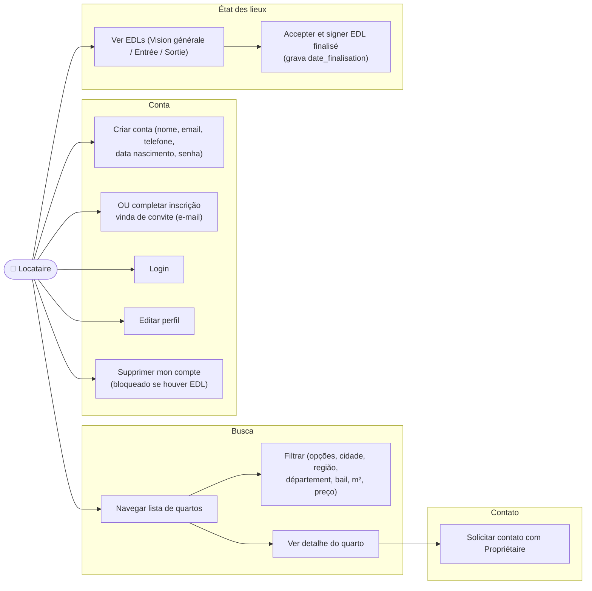
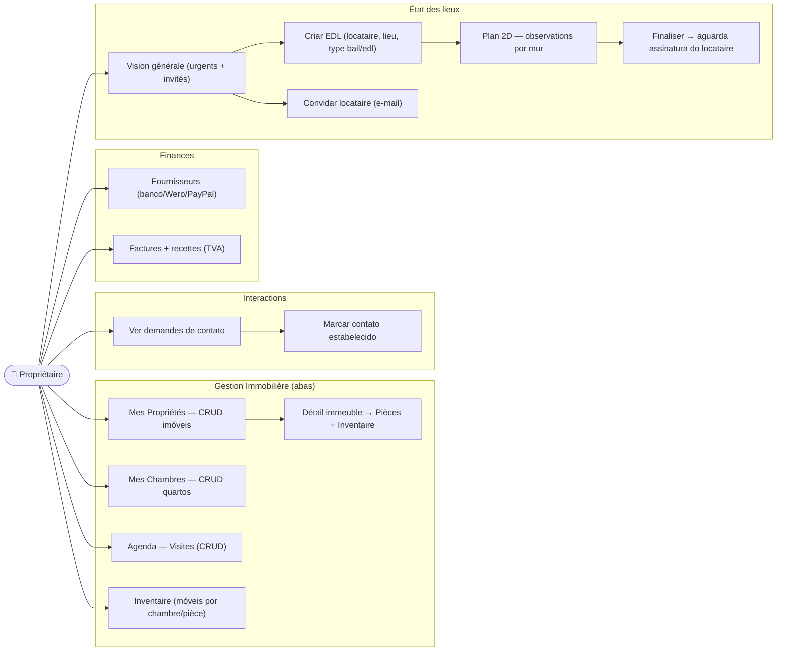
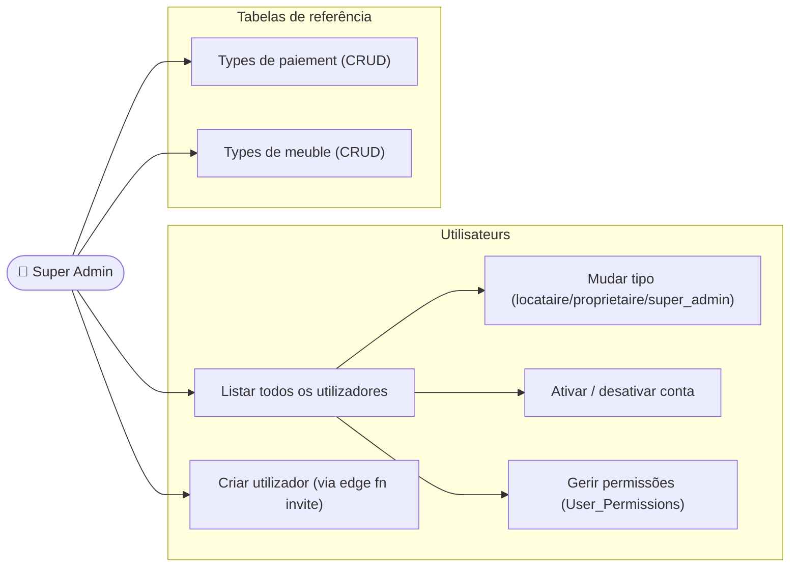

# Diagramas de Casos de Uso — La Coloc

## Visão Geral do Sistema

```mermaid
graph TD
    subgraph Atores
        V(["👤 Visiteur (anônimo)"])
        L(["🏠 Locataire"])
        P(["🏢 Propriétaire"])
        A(["🔑 Super Admin"])
    end

    subgraph Publico["Área Pública"]
        UC1["Visualizar quartos disponíveis"]
        UC2["Filtrar quartos"]
        UC3["Ver detalhes de um quarto"]
        UC5["Criar conta Locataire"]
        UC6["Demander un compte Propriétaire"]
        UC7["Login / Logout"]
    end

    subgraph Compte["Conta"]
        UC9["Editar perfil (nome, telefone, dob)"]
        UC9b["Supprimer mon compte (edge fn)"]
    end

    subgraph LocAcoes["Locataire"]
        UC10["Solicitar contato (Demande de Contact)"]
        UC10b["Completar inscrição via convite"]
        UC10c["Consultar états des lieux recebidos"]
        UC10d["Accepter et signer un EDL finalisé"]
    end

    subgraph PropAcoes["Propriétaire"]
        UC11["Gerenciar imóveis (CRUD)"]
        UC14["Gerenciar quartos (CRUD)"]
        UC14b["Gerenciar pièces (áreas comuns)"]
        UC14c["Gerenciar inventário (móveis)"]
        UC15["Agenda de visitas (CRUD)"]
        UC17["Ver interações (demandes recebidas)"]
        UC18["Marcar contato estabelecido"]
        UC19["Gerenciar fornecedores (dados bancários)"]
        UC20["Gerenciar faturas / recettes"]
        UC21["Consultar documentação"]
        UC22["Criar/gerir états des lieux (entrée/sortie)"]
        UC22b["Convidar locataire (edge fn invite)"]
        UC22c["Finaliser un EDL"]
    end

    subgraph AdminAcoes["Super Admin"]
        UC30["Gerir utilizadores (tipo, ativo, permissões)"]
        UC31["Gerir tipos de pagamento"]
        UC32["Gerir tipos de meuble"]
    end

    V --> UC1 & UC2 & UC3 & UC5 & UC6 & UC7
    L --> UC1 & UC2 & UC3 & UC7 & UC9 & UC9b & UC10 & UC10b & UC10c & UC10d
    P --> UC7 & UC9 & UC11 & UC14 & UC14b & UC14c & UC15 & UC17 & UC18 & UC19 & UC20 & UC21 & UC22 & UC22b & UC22c
    A --> UC7 & UC9 & UC30 & UC31 & UC32
```

---

## UC Detalhado — Fluxo do Locataire

---

## UC Detalhado — Fluxo do Propriétaire

---

## UC Detalhado — Fluxo do Super Admin

