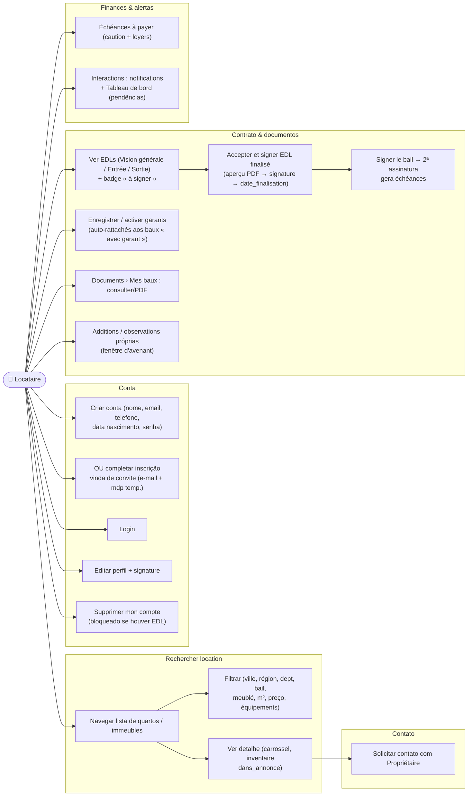
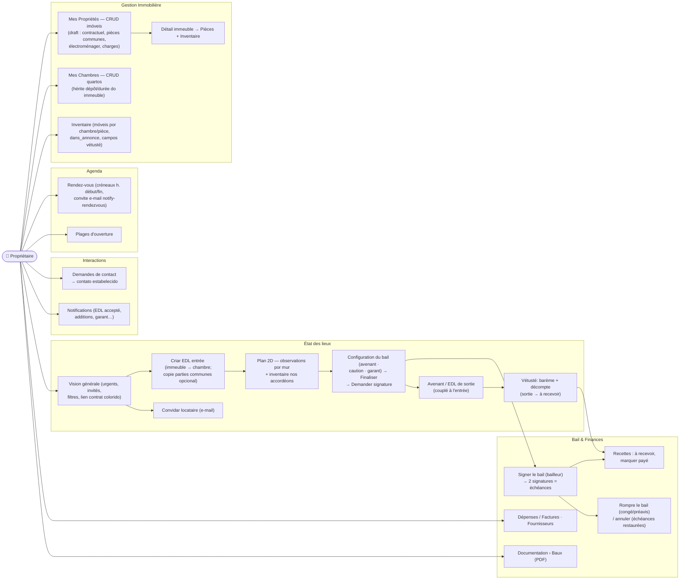
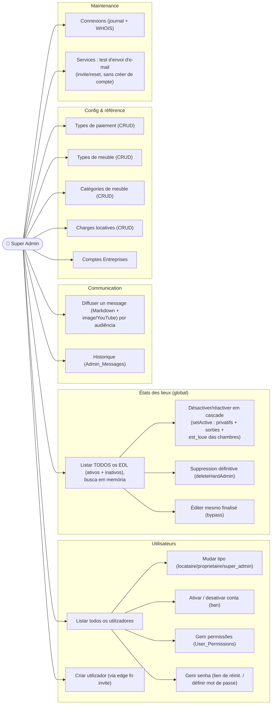

# Diagramas de Casos de Uso — Super Loc

## Visão Geral do Sistema

```mermaid
graph TD
    subgraph Atores
        V(["👤 Visiteur (anônimo)"])
        L(["🏠 Locataire"])
        P(["🏢 Propriétaire"])
        A(["🔑 Super Admin"])
    end

    subgraph Publico["Área Pública"]
        UC1["Visualizar quartos disponíveis"]
        UC2["Filtrar (ville, prix, meublé, équipements…)"]
        UC3["Ver detalhes de um quarto / immeuble"]
        UC5["Criar conta Locataire"]
        UC6["Demander un compte Propriétaire"]
        UC7["Login / Logout"]
    end

    subgraph Compte["Conta"]
        UC9["Editar perfil (nome, telefone, dob)"]
        UC9b["Enregistrer sa signature électronique"]
        UC9c["Supprimer mon compte (edge fn,\nbloqueado se houver EDL)"]
    end

    subgraph LocAcoes["Locataire"]
        UC10["Solicitar contato (Demande de Contact)"]
        UC10b["Completar inscrição via convite"]
        UC10c["Consultar états des lieux (badge)"]
        UC10d["Accepter et signer un EDL finalisé"]
        UC10e["Signer le bail (bail_*)"]
        UC10f["Gérer ses garants (Documents › Garants)"]
        UC10g["Consulter ses baux (Documents › Mes baux)"]
        UC10h["Voir ses échéances à payer (Finances)"]
        UC10i["Additions / avenant (fenêtre ouverte)"]
    end

    subgraph PropAcoes["Propriétaire"]
        UC11["Gerenciar imóveis (CRUD, draft)"]
        UC14["Gerenciar quartos (CRUD)"]
        UC14b["Gerenciar pièces (áreas comuns)"]
        UC14c["Gerenciar inventário (dans_annonce, vétusté)"]
        UC15["Agenda : rendez-vous (créneaux)\n+ plages d'ouverture"]
        UC17["Ver interações (demandes + notifications)"]
        UC18["Marcar contato estabelecido"]
        UC19["Gerenciar fornecedores (dados bancários)"]
        UC20["Finances : recettes (échéances)\n+ dépenses/factures"]
        UC21["Documentation : baux + ma signature"]
        UC22["Criar/gerir états des lieux\n(entrée/sortie, avenant)"]
        UC22b["Convidar locataire (edge fn invite)"]
        UC22c["Configuration du bail + Finaliser\n+ Demander signature"]
        UC22d["Signer le bail / Rompre le bail"]
        UC22e["Vétusté : barème + décompte (sortie)"]
    end

    subgraph AdminAcoes["Super Admin"]
        UC30["Gerir utilizadores (tipo, ativo,\npermissões, senha)"]
        UC31["États des lieux (global) :\nativar/desativar, suppression définitive"]
        UC32["Communication (diffusion de messages)"]
        UC33["Comptes Entreprises"]
        UC34["Config Immeuble : types de meuble ·\ncatégories · charges locatives"]
        UC35["Types de paiement"]
        UC36["Maintenance : connexions (WHOIS) ·\nservices (test e-mail)"]
    end

    V --> UC1 & UC2 & UC3 & UC5 & UC6 & UC7
    L --> UC1 & UC2 & UC3 & UC7 & UC9 & UC9b & UC9c
    L --> UC10 & UC10b & UC10c & UC10d & UC10e & UC10f & UC10g & UC10h & UC10i
    P --> UC7 & UC9 & UC9b
    P --> UC11 & UC14 & UC14b & UC14c & UC15 & UC17 & UC18 & UC19 & UC20 & UC21
    P --> UC22 & UC22b & UC22c & UC22d & UC22e
    A --> UC7 & UC9 & UC30 & UC31 & UC32 & UC33 & UC34 & UC35 & UC36
```

---

## UC Detalhado — Fluxo do Locataire

O menu do locataire (`AppNavSidebar`): **Rechercher location** · **Tableau de
bord** · **État des lieux** · **Interactions** · **Documents** (Mes baux ·
Garants) · **Finances** · **Mon Profil**.

```mermaid
flowchart LR
    L(["👤 Locataire"])

    subgraph Conta
        S1["Criar conta (nome, email, telefone,\ndata nascimento, senha)"]
        S1b["OU completar inscrição\nvinda de convite (e-mail + mdp temp.)"]
        S2["Login"]
        S3["Editar perfil + signature"]
        S3b["Supprimer mon compte\n(bloqueado se houver EDL)"]
    end

    subgraph Busca["Rechercher location"]
        S4["Navegar lista de quartos / immeubles"]
        S5["Filtrar (ville, région, dept, bail,\nmeublé, m², preço, équipements)"]
        S6["Ver detalhe (carrossel, inventaire\ndans_annonce)"]
    end

    subgraph Contato
        S8["Solicitar contato com Propriétaire"]
    end

    subgraph Dossier["Contrato & documentos"]
        S9["Ver EDLs (Vision générale / Entrée / Sortie)\n+ badge « à signer »"]
        S10["Accepter et signer EDL finalisé\n(aperçu PDF → signature → date_finalisation)"]
        S11["Enregistrer / activer garants\n(auto-rattachés aos baux « avec garant »)"]
        S12["Signer le bail → 2ª assinatura\ngera échéances"]
        S13["Documents › Mes baux : consulter/PDF"]
        S14["Additions / observations próprias\n(fenêtre d'avenant)"]
    end

    subgraph Fin["Finances & alertas"]
        S15["Échéances à payer (caution + loyers)"]
        S16["Interactions : notifications\n+ Tableau de bord (pendências)"]
    end

    L --> S1 & S1b & S2 & S3 & S3b
    L --> S4
    S4 --> S5 & S6
    S6 --> S8
    L --> S9
    S9 --> S10 --> S12
    L --> S11 & S13 & S14
    L --> S15 & S16
```

---

## UC Detalhado — Fluxo do Propriétaire

Menu (`AppNavSidebar` com submenus): **Vue générale** · **Gestion Immobilière**
(Mes Propriétés · Mes Chambres · Inventaire) · **Agenda** · **Finances** (Vue
générale · Recettes · Dépenses/Factures) · **Fournisseurs** · **État des lieux**
(Vision générale · Entrée · Sortie · Vétusté) · **Documentation** (Vue générale ·
Baux · Ma signature) · **Interactions** · **Mon Profil**.

```mermaid
flowchart LR
    P(["🏢 Propriétaire"])

    subgraph Patrimoine["Gestion Immobilière"]
        M1["Mes Propriétés — CRUD imóveis\n(draft : contractuel, pièces communes,\nélectroménager, charges)"]
        M2["Mes Chambres — CRUD quartos\n(hérite dépôt/durée do immeuble)"]
        M3["Inventaire (móveis por chambre/pièce,\ndans_annonce, campos vétusté)"]
        M4["Détail immeuble → Pièces + Inventaire"]
    end

    subgraph Agenda
        A1["Rendez-vous (créneaux h. début/fin,\nconvite e-mail notify-rendezvous)"]
        A2["Plages d'ouverture"]
    end

    subgraph Interactions
        I1["Demandes de contact\n→ contato estabelecido"]
        I2["Notifications (EDL accepté,\nadditions, garant…)"]
    end

    subgraph EDL["État des lieux"]
        E1["Vision générale (urgents, invités,\nfiltres, lien contrat colorido)"]
        E2["Criar EDL entrée (immeuble → chambre;\ncopie parties communes opcional)"]
        E3["Plan 2D — observations por mur\n+ inventaire nos accordéons"]
        E4["Convidar locataire (e-mail)"]
        E5["Configuration du bail (avenant ·\ncaution · garant) → Finaliser\n→ Demander signature"]
        E6["Avenant / EDL de sortie\n(couplé à l'entrée)"]
        E7["Vétusté: barème + décompte\n(sortie → à recevoir)"]
    end

    subgraph Bail["Bail & Finances"]
        B1["Signer le bail (bailleur)\n→ 2 signatures = échéances"]
        B2["Rompre le bail (congé/préavis)\n/ annuler (échéances restaurées)"]
        B3["Recettes : à recevoir,\nmarquer payé"]
        B4["Dépenses / Factures · Fournisseurs"]
        B5["Documentation › Baux (PDF)"]
    end

    P --> M1 & M2 & M3
    M1 --> M4
    P --> A1 & A2
    P --> I1 & I2
    P --> E1 --> E2 --> E3 --> E5
    E1 --> E4
    E5 --> B1 --> B3
    E5 --> E6 --> E7 --> B3
    B1 --> B2
    P --> B4 & B5
```

---

## UC Detalhado — Fluxo do Super Admin

Menu: **Tableau de bord** · **Utilisateurs** · **États des lieux** ·
**Communication** · **Comptes Entreprises** · **Types de paiement** · **Config
Immeuble** · **Maintenance**.

```mermaid
flowchart LR
    A(["🔑 Super Admin"])

    subgraph Utilisateurs
        U1["Listar todos os utilizadores"]
        U2["Mudar tipo (locataire/proprietaire/super_admin)"]
        U3["Ativar / desativar conta (ban)"]
        U4["Gerir permissões (User_Permissions)"]
        U5["Criar utilizador (via edge fn invite)"]
        U6["Gerir senha (lien de réinit. /\ndéfinir mot de passe)"]
    end

    subgraph EDLAdmin["États des lieux (global)"]
        D1["Listar TODOS os EDL (ativos + inativos),\nbusca em memória"]
        D2["Désactiver/réactiver em cascade\n(setActive : privatifs + sorties +\nest_loue das chambres)"]
        D3["Suppression définitive (deleteHardAdmin)"]
        D4["Éditer mesmo finalisé (bypass)"]
    end

    subgraph Comm["Communication"]
        C1["Diffuser un message (Markdown +\nimage/YouTube) por audiência"]
        C2["Historique (Admin_Messages)"]
    end

    subgraph Referencias["Config & référence"]
        R1["Types de paiement (CRUD)"]
        R2["Types de meuble (CRUD)"]
        R3["Catégories de meuble (CRUD)"]
        R4["Charges locatives (CRUD)"]
        R5["Comptes Entreprises"]
    end

    subgraph Maint["Maintenance"]
        M1["Connexions (journal + WHOIS)"]
        M2["Services : test d'envoi d'e-mail\n(invite/reset, sans créer de compte)"]
    end

    A --> U1 --> U2 & U3 & U4 & U6
    A --> U5
    A --> D1 --> D2 & D3 & D4
    A --> C1 & C2
    A --> R1 & R2 & R3 & R4 & R5
    A --> M1 & M2
```
