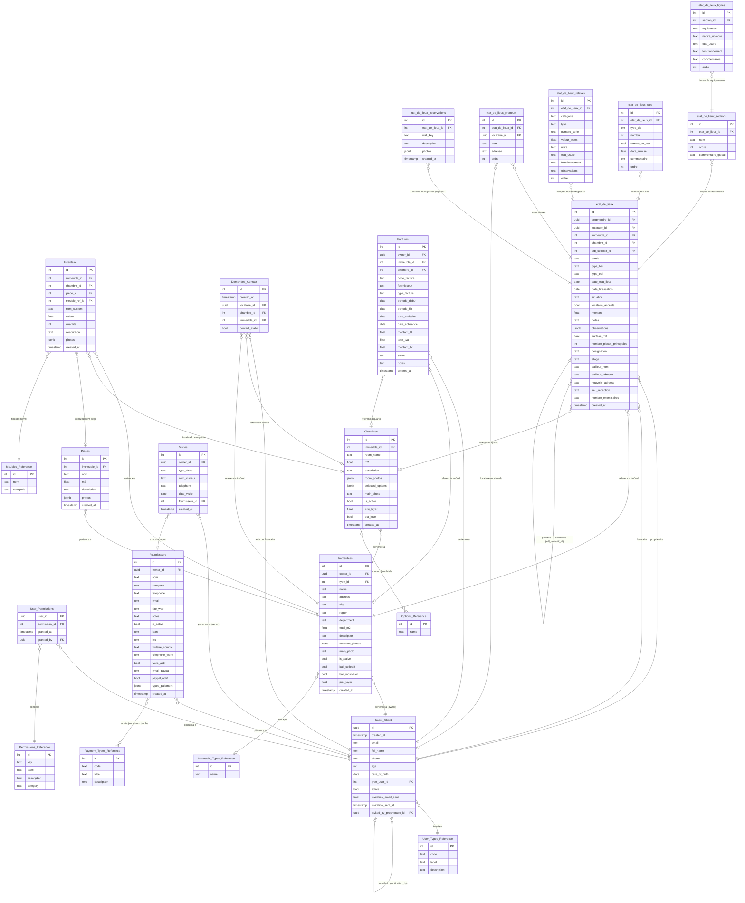

# Modelo de Dados (ERD) — La Coloc

> Atualizado para refletir o esquema completo: referência, patrimônio, finanças,
> état des lieux, inventário, visitas e permissões.

## Diagrama Entidade-Relacionamento

---

## Tabelas de Referência (editadas pelo Super Admin)

| Tabela | Campos | Editor |
|---|---|---|
| `User_Types_Reference` | id, **code** (`locataire`/`proprietaire`/`super_admin`), label, description | (seed) |
| `Immeuble_Types_Reference` | id, name | Super Admin |
| `Options_Reference` | id, name | Super Admin |
| `Payment_Types_Reference` | id, code, label, description | Super Admin (`PaymentTypesPage`) |
| `Meubles_Reference` | id, nom, categorie | Super Admin (`MeubleTypesPage`) |
| `Permissions_Reference` | id, key, label, description, category | (seed) |

---

## Resumo das Relações

| Relação | Cardinalidade |
|---|---|
| Propriétaire → Immeubles | 1 : N |
| Immeuble → Chambres | 1 : N |
| Immeuble → Pieces | 1 : N |
| Immeuble → Inventaire | 1 : N |
| Chambre / Pièce → Inventaire | 1 : N (exclusivo: item fica numa chambre **ou** numa pièce) |
| Inventaire → Meubles_Reference | N : 0..1 (ou `nom_custom` livre) |
| Chambre → Options_Reference | N : N (ids em JSONB `selected_options`) |
| Locataire → Demandes_Contact | 1 : N |
| Propriétaire → Fournisseurs / Factures / Visites | 1 : N |
| Fournisseur → Payment_Types_Reference | N : N (codes em JSONB `types_paiement`) |
| Propriétaire / Locataire → etat_de_lieux | 1 : N |
| etat_de_lieux → etat_de_lieux_observations | 1 : N (também há cópia denormalizada em `observations` JSONB) |
| Propriétaire → Locataires convidados | 1 : N (`invited_by_proprietaire_id`) |
| User → Permissions | N : N (via `User_Permissions`) |

---

## Notas de Implementação

- **Fotos**: `Immeubles.common_photos`, `Chambres.room_photos`, `Inventaire.photos` e
  `etat_de_lieux_observations.photos` são arrays JSONB de URLs do bucket `photos`.
  `Pieces.photos` é um array de objetos `{ url, dans_annonce }` — o flag `dans_annonce`
  controla se a foto da peça aparece no anúncio público.
- **Idade**: sempre calculada a partir de `date_of_birth`; `age` é fallback legado.
- **Observations do EDL**: persistidas em DOIS lugares — coluna `observations` (JSONB,
  `{ wall_key: { description, photos } }`) no `etat_de_lieux` e linhas individuais em
  `etat_de_lieux_observations`. As `wall_key` conhecidas: `fond`, `gauche`, `droit`,
  `porte` (e `null`/`Général` para observação geral).
- **Trigger de criação de usuário**: `auth.users` → trigger `SECURITY DEFINER` cria a
  linha em `Users_Client`, lendo `raw_user_meta_data` (`full_name`, `type_code`, `phone`,
  `date_of_birth`).
