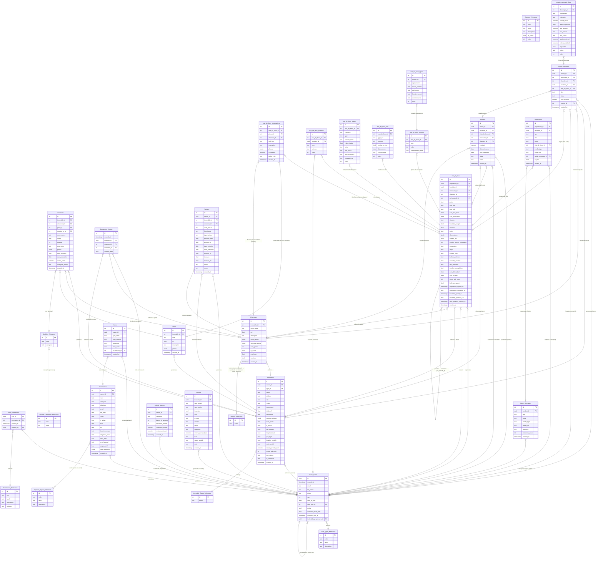

# Modelo de Dados (ERD) — Super Loc

> Atualizado para refletir o esquema completo: referência, patrimônio, finanças,
> état des lieux, inventário, visitas e permissões.

## Diagrama Entidade-Relacionamento

```mermaid
erDiagram
    Users_Client {
        uuid id PK
        timestamp created_at
        text email
        text full_name
        text phone
        int age
        date date_of_birth
        int type_user_id FK
        bool active
        bool invitation_email_sent
        timestamp invitation_sent_at
        uuid invited_by_proprietaire_id FK
    }

    User_Types_Reference {
        int id PK
        text code
        text label
        text description
    }

    Permissions_Reference {
        int id PK
        text key
        text label
        text description
        text category
    }

    User_Permissions {
        uuid user_id FK
        int permission_id FK
        timestamp granted_at
        uuid granted_by FK
    }

    Immeubles {
        int id PK
        uuid owner_id FK
        int type_id FK
        text name
        text address
        text city
        text region
        text department
        float total_m2
        text description
        jsonb common_photos
        text main_photo
        bool is_active
        bool bail_location
        bool bail_individuel
        float prix_loyer
        bool location_meuble
        text code_postal
        numeric depot_garantie_mois
        int duree_bail_mois
        text dpe_classe
        text irl_reference
        timestamp created_at
    }

    Immeuble_Types_Reference {
        int id PK
        text name
    }

    Chambres {
        int id PK
        int immeuble_id FK
        text room_name
        float m2
        text description
        jsonb room_photos
        jsonb selected_options
        text main_photo
        bool is_active
        float prix_loyer
        bool est_loue
        timestamp created_at
    }

    Options_Reference {
        int id PK
        text name
    }

    Pieces {
        int id PK
        int immeuble_id FK
        text nom
        float m2
        text description
        jsonb photos
        timestamp created_at
    }

    Meubles_Reference {
        int id PK
        text nom
        text categorie
    }

    Meuble_Categories_Reference {
        int id PK
        text nom
        int ordre
    }

    Inventaire {
        int id PK
        int immeuble_id FK
        int chambre_id FK
        int piece_id FK
        int meuble_ref_id FK
        text nom_custom
        float valeur
        int quantite
        text description
        jsonb photos
        bool dans_annonce
        date date_acquisition
        numeric valeur_achat
        text categorie_vetuste
        timestamp created_at
    }

    Demandes_Contact {
        int id PK
        timestamp created_at
        uuid locataire_id FK
        int chambre_id FK
        int immeuble_id FK
        bool contact_etabli
    }

    Fournisseurs {
        int id PK
        uuid owner_id FK
        text nom
        text categorie
        text telephone
        text email
        text site_web
        text notes
        bool is_active
        text iban
        text bic
        text titulaire_compte
        text telephone_wero
        bool wero_actif
        text email_paypal
        bool paypal_actif
        jsonb types_paiement
        timestamp created_at
    }

    Factures {
        int id PK
        uuid owner_id FK
        int immeuble_id FK
        int chambre_id FK
        text code_facture
        text fournisseur
        text type_facture
        date periode_debut
        date periode_fin
        date date_emission
        date date_echeance
        float montant_ht
        float taux_tva
        float montant_ttc
        text statut
        text notes
        timestamp created_at
    }

    Payment_Types_Reference {
        int id PK
        text code
        text label
        text description
    }

    etat_de_lieux {
        int id PK
        uuid proprietaire_id FK
        uuid locataire_id FK
        int immeuble_id FK
        int chambre_id FK
        int edl_collectif_id FK
        text partie
        text type_bail
        text type_edl
        date date_etat_lieux
        date date_finalisation
        text situation
        bool locataire_accepte
        float montant
        text notes
        jsonb observations
        float surface_m2
        int nombre_pieces_principales
        text designation
        text etage
        text bailleur_nom
        text bailleur_adresse
        text nouvelle_adresse
        text lieu_redaction
        text nombre_exemplaires
        date date_debut_bail
        date date_fin_bail
        int duree_bail_mois
        bool bail_avec_garant
        timestamp proprietaire_signed_at
        text proprietaire_signature_url
        timestamp locataire_signed_at
        text locataire_signature_url
        timestamp last_signature_request_at
        timestamp created_at
    }

    etat_de_lieux_observations {
        int id PK
        int etat_de_lieux_id FK
        int piece_id FK
        int chambre_id FK
        text wall_key
        text description
        jsonb photos
        boolean is_addition
        text author_role
        timestamp created_at
    }
    %% wall_key: fond/gauche/droit/porte/sol/plafond (plan 2D), null=général,
    %% ou 'divers' = observation libre de l'onglet « Divers » (sans piece/chambre).

    etat_de_lieux_preneurs {
        int id PK
        int etat_de_lieux_id FK
        uuid locataire_id FK
        text nom
        text adresse
        int ordre
    }

    etat_de_lieux_releves {
        int id PK
        int etat_de_lieux_id FK
        text categorie
        text type
        text numero_serie
        float valeur_index
        text unite
        text etat_usure
        text fonctionnement
        text observations
        int ordre
    }

    etat_de_lieux_cles {
        int id PK
        int etat_de_lieux_id FK
        text type_cle
        int nombre
        bool remise_ce_jour
        date date_remise
        text commentaire
        int ordre
    }

    etat_de_lieux_sections {
        int id PK
        int etat_de_lieux_id FK
        text nom
        int ordre
        text commentaire_global
    }

    etat_de_lieux_lignes {
        int id PK
        int section_id FK
        text equipement
        text nature_nombre
        text etat_usure
        text fonctionnement
        text commentaires
        int ordre
    }

    Charges_Reference {
        int id PK
        text nom
        text icone
        text description
        bool is_active
        int ordre
    }

    Recettes {
        int id PK
        uuid owner_id FK
        uuid locataire_id FK
        int etat_de_lieux_id FK
        int immeuble_id FK
        int chambre_id FK
        numeric montant
        date date_echeance
        date date_paiement
        text statut
        text notes
        timestamp created_at
    }

    vetuste_bareme {
        int id PK
        uuid owner_id FK
        text categorie
        int duree_vie_annees
        int franchise_annees
        numeric coefficient_annuel
        numeric residuel_min_pct
        timestamp created_at
    }

    vetuste_decompte {
        int id PK
        uuid owner_id FK
        int immeuble_id FK
        int chambre_id FK
        uuid locataire_id FK
        int etat_de_lieux_id FK
        text titre
        text statut
        numeric total_montant
        int recette_id FK
        timestamp created_at
    }

    vetuste_decompte_ligne {
        int id PK
        int decompte_id FK
        text equipement
        text categorie
        numeric valeur_achat
        date date_acquisition
        numeric age_annees
        text etat_entree
        text etat_sortie
        numeric abattement_pct
        numeric valeur_residuelle
        bool imputable
        text notes
        int ordre
    }

    Visites {
        int id PK
        uuid owner_id FK
        text type_visite
        text nom_visiteur
        text telephone
        date date_visite
        int fournisseur_id FK
        timestamp created_at
    }

    Garants {
        int id PK
        uuid locataire_id FK
        text type_garant
        text type_caution
        bool is_active
        text nom
        text prenom
        text adresse
        text email
        text telephone
        numeric revenu_mensuel_net
        text iban
        text raison_sociale
        text siret
        timestamp created_at
    }

    Notifications {
        int id PK
        uuid proprietaire_id FK
        uuid recipient_id FK
        text type
        text title
        text body
        int etat_de_lieux_id FK
        text media_type
        text media_url
        int admin_message_id FK
        bool is_read
        timestamp created_at
    }

    Admin_Messages {
        int id PK
        uuid sender_id FK
        text title
        text body
        text media_type
        text media_url
        text audience
        int recipients_count
        timestamp created_at
    }

    Users_Client }o--|| User_Types_Reference : "tem tipo"
    Garants }o--|| Users_Client : "garant de (locataire)"
    Notifications }o--|| Users_Client : "destinée à (recipient)"
    Notifications }o--o| etat_de_lieux : "concerne un EDL"
    Notifications }o--o| Admin_Messages : "issue d'une diffusion"
    Admin_Messages }o--|| Users_Client : "envoyé par (super admin)"
    Users_Client }o--o| Users_Client : "convidado por (invited_by)"
    User_Permissions }o--|| Users_Client : "atribuída a"
    User_Permissions }o--|| Permissions_Reference : "concede"
    Immeubles }o--|| Users_Client : "pertence a (owner)"
    Immeubles }o--o| Immeuble_Types_Reference : "tem tipo"
    Chambres }o--|| Immeubles : "pertence a"
    Chambres }o--o{ Options_Reference : "selected_options (legado — substituído por Inventaire dans_annonce)"
    Pieces }o--|| Immeubles : "pertence a"
    Inventaire }o--|| Immeubles : "pertence a"
    Inventaire }o--o| Chambres : "localizado em quarto"
    Inventaire }o--o| Pieces : "localizado em peça"
    Inventaire }o--o| Meubles_Reference : "tipo de móvel"
    Meubles_Reference }o--o| Meuble_Categories_Reference : "categoria (por nome)"
    Recettes }o--|| Users_Client : "pertence a (owner)"
    Recettes }o--o| Users_Client : "à recevoir do locataire"
    Recettes }o--o| etat_de_lieux : "origem (bail/sortie)"
    Recettes }o--o| Immeubles : "referencia imóvel"
    Recettes }o--o| Chambres : "referencia quarto"
    vetuste_bareme }o--|| Users_Client : "barème do proprietaire"
    vetuste_decompte }o--|| Users_Client : "pertence a (owner)"
    vetuste_decompte }o--|| Immeubles : "referencia imóvel"
    vetuste_decompte }o--o| Chambres : "referencia quarto"
    vetuste_decompte }o--o| Users_Client : "locataire concernido"
    vetuste_decompte }o--o| etat_de_lieux : "origem (EDL sortie)"
    vetuste_decompte }o--o| Recettes : "gera à recevoir"
    vetuste_decompte_ligne }o--|| vetuste_decompte : "linhas do décompte"
    Demandes_Contact }o--|| Users_Client : "feita por locataire"
    Demandes_Contact }o--o| Chambres : "referencia quarto"
    Demandes_Contact }o--|| Immeubles : "referencia imóvel"
    Fournisseurs }o--|| Users_Client : "pertence a"
    Fournisseurs }o--o{ Payment_Types_Reference : "aceita (codes em jsonb)"
    Factures }o--|| Users_Client : "pertence a"
    Factures }o--o| Immeubles : "referencia imóvel"
    Factures }o--o| Chambres : "referencia quarto"
    etat_de_lieux }o--|| Users_Client : "proprietaire"
    etat_de_lieux }o--|| Users_Client : "locataire"
    etat_de_lieux }o--|| Immeubles : "referencia imóvel"
    etat_de_lieux }o--o| Chambres : "referencia quarto"
    etat_de_lieux }o--o| etat_de_lieux : "privative → commune (edl_collectif_id)"
    etat_de_lieux_observations }o--|| etat_de_lieux : "detalha murs/pièces (legado)"
    etat_de_lieux_observations }o--o| Pieces : "observação de pièce (collectif)"
    etat_de_lieux_observations }o--o| Chambres : "observação de chambre (collectif)"
    etat_de_lieux_preneurs }o--|| etat_de_lieux : "colocataires"
    etat_de_lieux_preneurs }o--o| Users_Client : "locataire (opcional)"
    etat_de_lieux_releves }o--|| etat_de_lieux : "compteurs/chauffage/eau"
    etat_de_lieux_cles }o--|| etat_de_lieux : "remise des clés"
    etat_de_lieux_sections }o--|| etat_de_lieux : "pièces do documento"
    etat_de_lieux_lignes }o--|| etat_de_lieux_sections : "linhas de equipamento"
    Visites }o--|| Users_Client : "pertence a (owner)"
    Visites }o--o| Fournisseurs : "executada por"
```

---

## Tabelas de Referência (editadas pelo Super Admin)

| Tabela | Campos | Editor |
|---|---|---|
| `User_Types_Reference` | id, **code** (`locataire`/`proprietaire`/`super_admin`), label, description | (seed) |
| `Immeuble_Types_Reference` | id, name | Super Admin |
| `Options_Reference` | id, name | **Legado** — os « équipements » da chambre migraram para `Inventaire` (itens com `chambre_id` + `dans_annonce=true`, catalogados em `Meubles_Reference` categoria « Équipement »). `selected_options` é preservado mas não mais editado/lido na UI. |
| `Payment_Types_Reference` | id, code, label, description | Super Admin (`PaymentTypesPage`) |
| `Meubles_Reference` | id, nom, categorie | Super Admin (`MeubleTypesPage`) |
| `Meuble_Categories_Reference` | id, nom, ordre | Super Admin (`MeubleCategoriesPage`) — onglet « Catégories » de Config Immeuble |
| `Charges_Reference` | id, nom, icone, description, is_active, ordre | Super Admin (`ChargesReferencePage`) — onglet « Charges locatives » |
| `Permissions_Reference` | id, key, label, description, category | (seed) |

> **Catégories de meuble** : `Inventaire`/`Meubles_Reference.categorie` est un texte qui doit
> correspondre au `nom` d'une ligne de `Meuble_Categories_Reference`. Ces catégories servent
> aussi de **clé du barème de vétusté** (`vetuste_bareme.categorie`).

---

## Resumo das Relações

| Relação | Cardinalidade |
|---|---|
| Propriétaire → Immeubles | 1 : N |
| Immeuble → Chambres | 1 : N |
| Immeuble → Pieces | 1 : N |
| Immeuble → Inventaire | 1 : N |
| Chambre / Pièce → Inventaire | 1 : N (exclusivo: item fica numa chambre **ou** numa pièce) |
| Inventaire → Meubles_Reference | N : 0..1 (ou `nom_custom` livre) |
| Chambre → Options_Reference | N : N (ids em JSONB `selected_options`) |
| Locataire → Demandes_Contact | 1 : N |
| Propriétaire → Fournisseurs / Factures / Visites | 1 : N |
| Fournisseur → Payment_Types_Reference | N : N (codes em JSONB `types_paiement`) |
| Propriétaire / Locataire → etat_de_lieux | 1 : N |
| etat_de_lieux → etat_de_lieux_observations | 1 : N (também há cópia denormalizada em `observations` JSONB) |
| Propriétaire → Locataires convidados | 1 : N (`invited_by_proprietaire_id`) |
| User → Permissions | N : N (via `User_Permissions`) |

---

## Notas de Implementação

- **Fotos**: `Immeubles.common_photos`, `Chambres.room_photos`, `Inventaire.photos` e
  `etat_de_lieux_observations.photos` são arrays JSONB de URLs do bucket `photos`.
  `Pieces.photos` é um array de objetos `{ url, dans_annonce }` — o flag `dans_annonce`
  controla se a foto da peça aparece no anúncio público.
- **Idade**: sempre calculada a partir de `date_of_birth`; `age` é fallback legado.
- **Observations do EDL**: persistidas em DOIS lugares — coluna `observations` (JSONB,
  `{ wall_key: { description, photos } }`) no `etat_de_lieux` e linhas individuais em
  `etat_de_lieux_observations`. As `wall_key` conhecidas: `fond`, `gauche`, `droit`,
  `porte` (e `null`/`Général` para observação geral).
  - **Escopo por pièce/chambre (EDL collectif)**: `etat_de_lieux_observations.piece_id`
    e `chambre_id` (ambos nullable, `on delete cascade`) escopam a observação a uma
    pièce **ou** chambre específica do imóvel. Ambos `null` = comportamento legado
    (EDL privatif single-room ou observação geral do EDL). No fluxo collectif cada
    pièce e cada chambre tem seu próprio plano de murs.
- **Trigger de criação de usuário**: `auth.users` → trigger `SECURITY DEFINER` cria a
  linha em `Users_Client`, lendo `raw_user_meta_data` (`full_name`, `type_code`, `phone`,
  `date_of_birth`).
- **Vétusté (Option B)**: três tabelas.
  - `vetuste_bareme` — barème por proprietaire (1 linha por categoria de meuble): `duree_vie_annees`,
    `franchise_annees`, `coefficient_annuel` (%/an), `residuel_min_pct` (%). Seed automático na 1ª leitura.
  - `vetuste_decompte` — um « décompte de réparations locatives » ligado a um imóvel (+ chambre/locataire/EDL
    opcionais). `statut` ∈ {`brouillon`, `genere`}; `recette_id` preenchido após « Générer l'à recevoir ».
  - `vetuste_decompte_ligne` — linhas do décompte (equipamento dégradé): `valeur_achat`, `age_annees`,
    `etat_entree`/`etat_sortie`, `abattement_pct`, `valeur_residuelle` (= valeur_achat × (1 − abattement/100)),
    `imputable`. Fórmula: `abattement% = clamp((âge − franchise) × coef_annuel, 0, 100 − résiduel_min)`.
  - **Cálculo** em `lib/utils/vetuste_calc.dart` (`VetusteCalc`). **Détection** entrée→sortie em
    `VetusteDatasource.buildCandidatesForSortie` (compara `etat_usure` das lignes; rangs N<B<U<M).
  - **À recevoir**: « Générer l'à recevoir » cria uma `Recettes` (statut `a_recevoir`) — aparece em Finances
    do proprietaire **e** do locataire (RLS `locataire_select_recettes`).
- **`Inventaire` vétusté**: `valeur_achat` (preço de compra), `date_acquisition` e `categorie_vetuste`
  (sobrepõe a categoria do meuble para itens `nom_custom`). Alimentam o pré-preenchimento do décompte.
