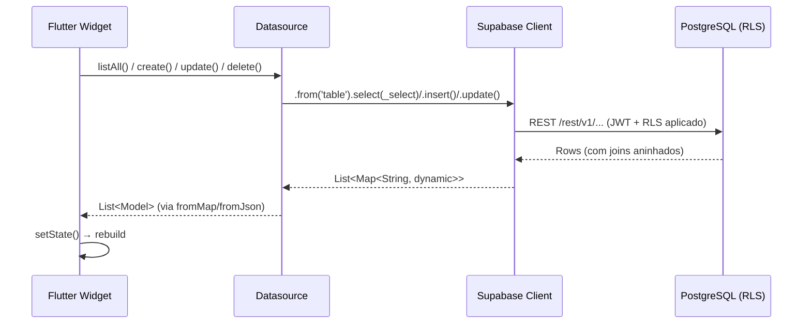
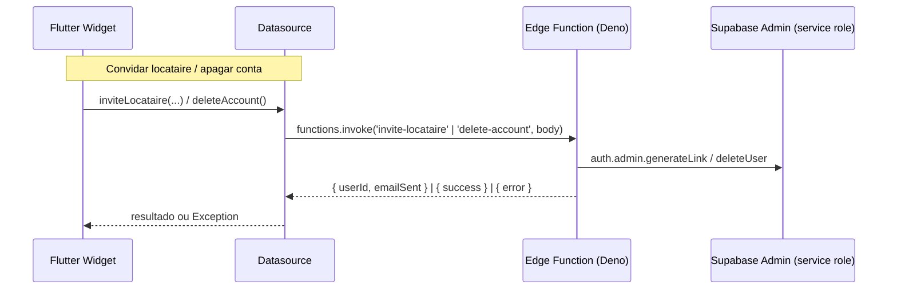
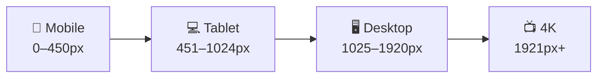

# Arquitetura do Sistema — La Coloc

## Visão em Camadas

```mermaid
graph TB
    subgraph Client["📱 Flutter App (Web / Mobile / Desktop)"]
        subgraph Presentation["Camada de Apresentação"]
            subgraph Public["Área Pública"]
                HP["HomePage (lista quartos)"]
                CD["ChambreDetailPage (carrossel/zoom)"]
            end
            subgraph Auth["Autenticação"]
                LG["LoginPage"]
                AG["AuthGate (roteamento pós-login)"]
                CL["CrierCompteLocatairePage"]
                CP["CrierCompteProprietairePage"]
                CC["CompléterInscriptionPage (convite)"]
            end
            subgraph Locataire["Área Locataire"]
                LP["LocataireProfil\n(Dashboard + Chambres + Profil + EDL)"]
            end
            subgraph Proprietaire["Área Propriétaire (SidebarX, 8 seções)"]
                PP["ProprietaireProfil"]
                VG["VueGeneralePage"]
                GI["Gestion Immobilière (abas)"]
                FN["FacturesListPage"]
                FO["FournisseursPage"]
                ED["EtatDesLieuxPage"]
                DOC["DocumentationPage"]
                INT["InteractionsPage"]
                MP["MonProfilProprietairePage"]
            end
            subgraph Admin["Área Super Admin (4 seções)"]
                SA["SuperAdminProfil"]
                UA["UtilisateursAdminPage"]
                PT["PaymentTypesPage"]
                MT["MeubleTypesPage"]
            end
        end

        subgraph Data["Camada de Dados (datasources estáticos)"]
            AS["AuthService"]
            IS["ImmeublesDatasource"]
            CS["ChambresDatasource"]
            PS["PiecesDatasource"]
            INV["InventaireDatasource"]
            FS["FacturesDatasource"]
            FOS["FournisseursDatasource"]
            DCS["DemandesContactDatasource"]
            EDS["EtatDesLieuxDatasource"]
            OBS["ObservationsEdlDatasource"]
            VS["VisitesDatasource"]
            UM["UserManagementDatasource"]
            PTS["PaymentTypesDatasource"]
            RS["ReferenceDatasource (cache)"]
            SS["StorageService"]
            ADDR["AddressSearchService"]
        end
    end

    subgraph Backend["☁️ Supabase"]
        subgraph DB["PostgreSQL + RLS"]
            T1[("Users_Client / *_Reference")]
            T2[("Immeubles / Chambres / Pieces")]
            T3[("Inventaire / Meubles_Reference")]
            T4[("Factures / Fournisseurs / Visites")]
            T5[("Demandes_Contact")]
            T6[("etat_de_lieux / _observations")]
            T7[("User_Permissions")]
        end
        subgraph RPC["RPC (SECURITY DEFINER)"]
            R1["search_locataires"]
            R2["list_invited_locataires"]
        end
        subgraph SAuth["Supabase Auth"]
            AUTH[("auth.users + trigger\n→ Users_Client")]
        end
        subgraph Storage["Storage"]
            BKT[("Bucket: photos")]
        end
        subgraph EF["Edge Functions (Deno)"]
            EF1["invite-locataire (create/resend)"]
            EF2["delete-account"]
            EF3["notify-proprietaire (referenciada)"]
        end
    end

    subgraph External["🌐 APIs Externas"]
        GOV["api-adresse.data.gouv.fr"]
        SMTP["SMTP (nodemailer)"]
    end

    Presentation --> Data
    AS --> AUTH
    AS --> EF2 & EF3
    EDS --> T6 & R1 & R2
    EDS --> EF1
    UM --> T1 & T7
    UM --> EF1
    IS --> T2
    CS --> T2
    PS --> T2
    INV --> T3
    FS --> T4
    FOS --> T4
    VS --> T4
    DCS --> T5
    OBS --> T6
    PTS --> T1
    RS --> T1
    SS --> BKT
    ADDR --> GOV
    EF1 --> SMTP
    EF1 --> AUTH
```



---

## Convenção de Datasource

Todos os datasources são classes com métodos `static` puros — sem instância, sem estado
(exceto `ReferenceDatasource`, que mantém cache em memória). Padrão:

```dart
class XyzDatasource {
  static final _db = Supabase.instance.client;
  static const _table = 'NomeTabela';
  static const _select = '*, relacao:Tabela!fk(campos)'; // joins PostgREST
  static Future<List<XyzModel>> listAll() async { ... }
}
```

---

## Fluxo de Dados (PostgREST)



---

## Fluxo via Edge Function / RPC



---

## Responsividade (responsive_framework)



- Decisões responsivas baseadas na **largura real do widget** via `LayoutBuilder`
  (não em `MediaQuery`), porque a sidebar consome parte da janela.
- Tabelas densas (états des lieux) alternam para **layout de card** abaixo de ~900px.
- Formulários centralizados/limitados por `ResponsiveFormWrapper`
  (full-width em MOBILE, `maxWidth` em TABLET/DESKTOP).
