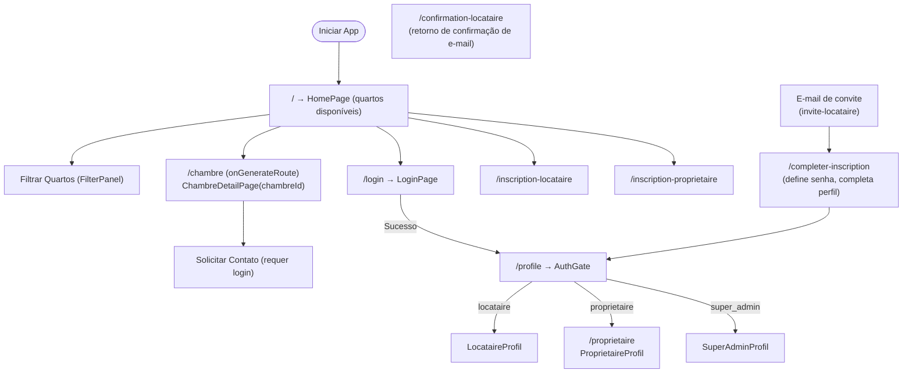
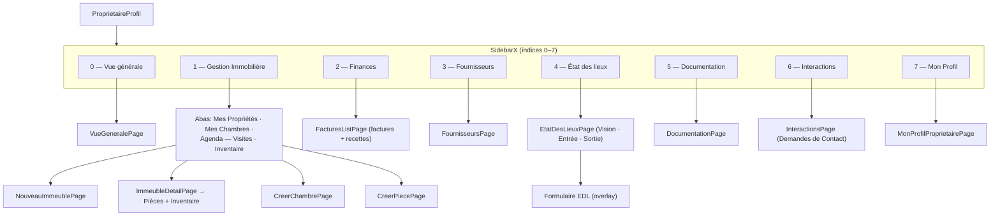
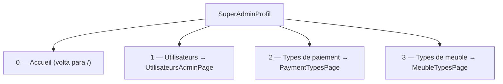
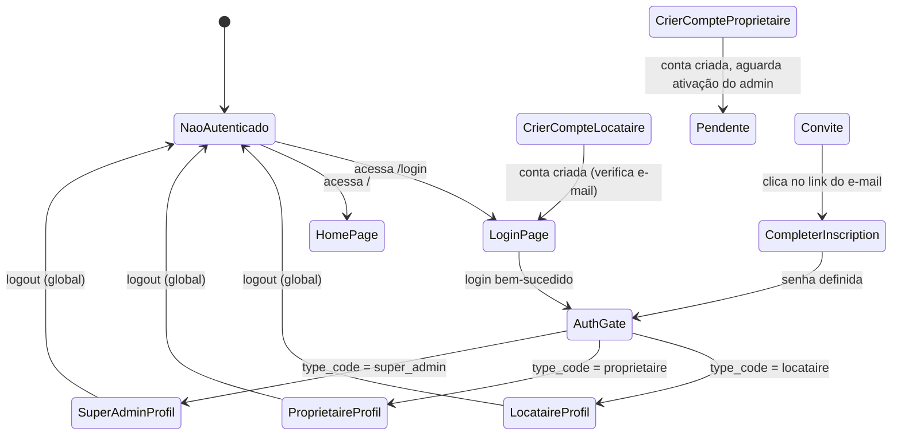
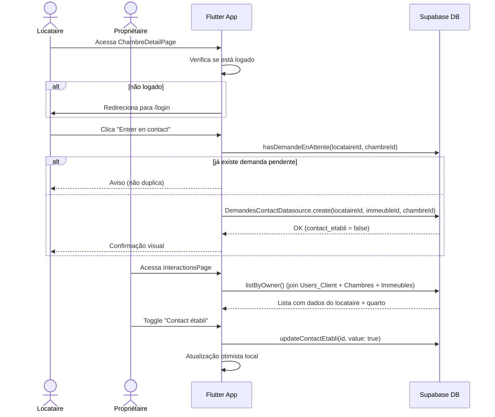

# Fluxo de Navegação — La Coloc

## Rotas Nomeadas + Rotas Dinâmicas

### Tabela de rotas (`MyApp`)

| Rota | Página |
|---|---|
| `/` | `HomePage` |
| `/login` | `LoginPage` |
| `/profile` | `AuthGate` (redireciona por tipo) |
| `/proprietaire` | `ProprietaireProfilPage` |
| `/inscription-locataire` | `CrierCompteLocatairePage` |
| `/inscription-proprietaire` | `CrierCompteProprietairePage` |
| `/completer-inscription` | página de conclusão de convite (define senha) |
| `/confirmation-locataire` | retorno da confirmação de e-mail |
| `/chambre` (dinâmica, `onGenerateRoute`) | `ChambreDetailPage(chambreId: int)` |

---

## Dashboard do Propriétaire (SidebarX — 8 seções)

---

## Dashboard do Super Admin (SidebarX — 4 índices)

---

## Fluxo de Autenticação

> O `signUp` envia `full_name`, `type_code`, `phone` e `date_of_birth` em
> `raw_user_meta_data`; o trigger no `auth.users` cria a linha `Users_Client`.
> O logout usa `SignOutScope.global` (revoga o refresh token no servidor).

---

## Fluxo de Demande de Contact

