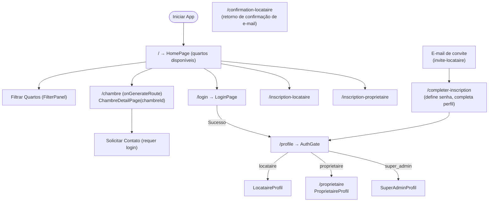
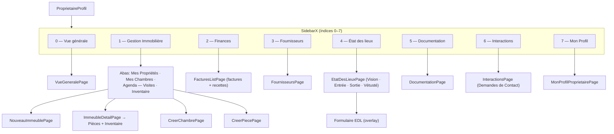
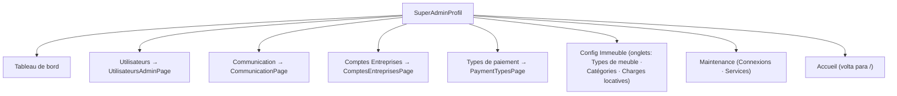
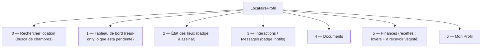
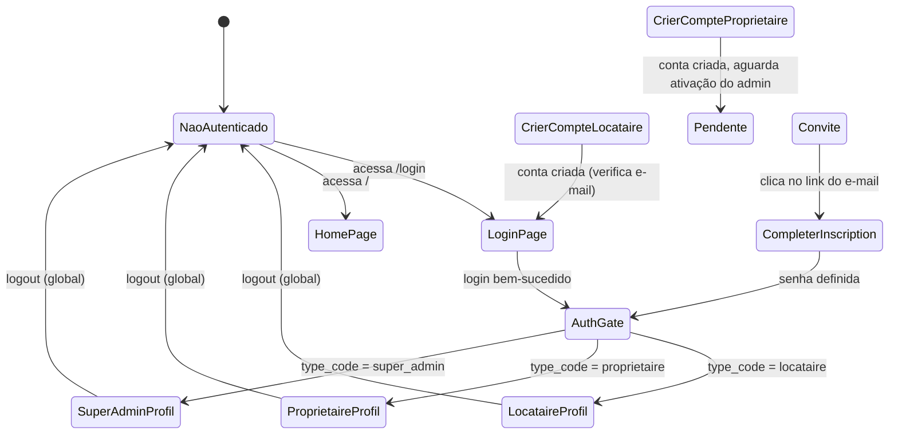
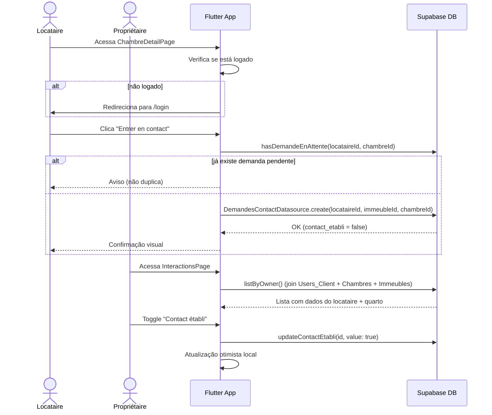

# Fluxo de Navegação — HabitaFrance

## Rotas Nomeadas + Rotas Dinâmicas

```mermaid
flowchart TD
    START([Iniciar App]) --> MAIN

    MAIN["/ → HomePage (quartos disponíveis)"]

    MAIN --> FILTER["Filtrar Quartos (FilterPanel)"]
    MAIN --> DETAIL["/chambre (onGenerateRoute)\nChambreDetailPage(chambreId)"]
    MAIN --> LOGIN["/login → LoginPage"]
    MAIN --> REG_L["/inscription-locataire"]
    MAIN --> REG_P["/inscription-proprietaire"]

    DETAIL --> CONTACT["Solicitar Contato (requer login)"]

    LOGIN -->|Sucesso| GATE["/profile → AuthGate"]

    EMAIL["E-mail de convite\n(invite-locataire)"] --> COMPL["/completer-inscription\n(define senha, completa perfil)"]
    COMPL --> GATE

    GATE -->|locataire| LPROFIL["LocataireProfil"]
    GATE -->|proprietaire| PPROFIL["/proprietaire\nProprietaireProfil"]
    GATE -->|super_admin| APROFIL["SuperAdminProfil"]

    CONF["/confirmation-locataire\n(retorno de confirmação de e-mail)"]
```

### Tabela de rotas (`MyApp`)

| Rota | Página |
|---|---|
| `/` | `HomePage` |
| `/login` | `LoginPage` |
| `/profile` | `AuthGate` (redireciona por tipo) |
| `/proprietaire` | `ProprietaireProfilPage` |
| `/inscription-locataire` | `CrierCompteLocatairePage` |
| `/inscription-proprietaire` | `CrierCompteProprietairePage` |
| `/completer-inscription` | página de conclusão de convite (define senha) |
| `/confirmation-locataire` | retorno da confirmação de e-mail |
| `/chambre` (dinâmica, `onGenerateRoute`) | `ChambreDetailPage(chambreId: int)` |

> **Accueil — fiches détail in-frame**: `HomePage` guarda `_detailChambreId`/`_detailImmeubleId`
> e renderiza `ChambreDetailView`/`ImmeublePublicDetailView` no cadre (menu à esquerda), sem
> nova rota. O botão **« Voir l'immeuble »** da fiche de chambre chama `onVoirImmeuble` → define
> `_detailImmeubleId` (a fiche do immeuble ganha prioridade no `_buildBody`) ; **Retour** limpa só
> `_detailImmeubleId` → volta à fiche da **chambre** (`_detailChambreId` ainda definido).

---

## Dashboard do Propriétaire (SidebarX — 8 seções)

```mermaid
flowchart TD
    PPROFIL["ProprietaireProfil"]

    subgraph Sidebar["SidebarX (índices 0–7)"]
        S0["0 — Vue générale"]
        S1["1 — Gestion Immobilière"]
        S2["2 — Finances"]
        S3["3 — Fournisseurs"]
        S4["4 — État des lieux"]
        S5["5 — Documentation"]
        S6["6 — Interactions"]
        S7["7 — Mon Profil"]
    end

    PPROFIL --> Sidebar

    S0 --> C0["VueGeneralePage"]
    S1 --> C1["Abas: Mes Propriétés · Mes Chambres ·\nAgenda — Visites · Inventaire"]
    S2 --> C2["FacturesListPage (factures + recettes)"]
    S3 --> C3["FournisseursPage"]
    S4 --> C4["EtatDesLieuxPage (Vision · Entrée · Sortie · Vétusté)"]
    S5 --> C5["DocumentationPage"]
    S6 --> C6["InteractionsPage (Demandes de Contact)"]
    S7 --> C7["MonProfilProprietairePage"]

    C1 --> NIMM["NouveauImmeublePage"]
    C1 --> IDET["ImmeubleDetailPage → Pièces + Inventaire"]
    C1 --> CCH["CreerChambrePage"]
    C1 --> CPC["CreerPiecePage"]
    C4 --> EDLFORM["Formulaire EDL (overlay)"]
```

---

## Dashboard do Super Admin (SidebarX)

```mermaid
flowchart TD
    APROFIL["SuperAdminProfil"]
    A0["Tableau de bord"]
    A1["Utilisateurs → UtilisateursAdminPage"]
    A2["Communication → CommunicationPage"]
    A3["Comptes Entreprises → ComptesEntreprisesPage"]
    A4["Types de paiement → PaymentTypesPage"]
    A5["Config Immeuble (onglets: Types de meuble ·\nCatégories · Charges locatives)"]
    A6["Maintenance (Connexions · Services)"]
    A7["Accueil (volta para /)"]
    APROFIL --> A0 & A1 & A2 & A3 & A4 & A5 & A6 & A7
```

> **Config Immeuble** reúne o CRUD de `Meubles_Reference` (`MeubleTypesPage`),
> `Meuble_Categories_Reference` (`MeubleCategoriesPage`) e `Charges_Reference`
> (`ChargesReferencePage`).

---

## Dashboard do Locataire (SidebarX)

```mermaid
flowchart TD
    LPROFIL["LocataireProfil"]
    L0["0 — Rechercher location (busca de chambres)"]
    L1["1 — Tableau de bord (read-only: o que está pendente)"]
    L2["2 — État des lieux (badge: à assinar)"]
    L3["3 — Interactions / Messages (badge: notifs)"]
    L4["4 — Documents"]
    L5["5 — Finances (recettes : loyers + à recevoir vétusté)"]
    L6["6 — Mon Profil"]
    LPROFIL --> L0 & L1 & L2 & L3 & L4 & L5 & L6
```

> O **Tableau de bord** é read-only e mostra atalhos para o que está pendente
> (EDL a assinar, mensagens). A « somme à recevoir » de um décompte de vétusté
> aparece em **Finances** (`listByLocataire`).

---

## Fluxo de Autenticação

```mermaid
stateDiagram-v2
    [*] --> NaoAutenticado

    NaoAutenticado --> LoginPage : acessa /login
    NaoAutenticado --> HomePage : acessa /

    LoginPage --> AuthGate : login bem-sucedido
    CrierCompteLocataire --> LoginPage : conta criada (verifica e-mail)
    CrierCompteProprietaire --> Pendente : conta criada, aguarda ativação do admin
    Convite --> CompleterInscription : clica no link do e-mail
    CompleterInscription --> AuthGate : senha definida

    AuthGate --> LocataireProfil : type_code = locataire
    AuthGate --> ProprietaireProfil : type_code = proprietaire
    AuthGate --> SuperAdminProfil : type_code = super_admin

    LocataireProfil --> NaoAutenticado : logout (global)
    ProprietaireProfil --> NaoAutenticado : logout (global)
    SuperAdminProfil --> NaoAutenticado : logout (global)
```

> O `signUp` envia `full_name`, `type_code`, `phone` e `date_of_birth` em
> `raw_user_meta_data`; o trigger no `auth.users` cria a linha `Users_Client`.
> O logout usa `SignOutScope.global` (revoga o refresh token no servidor).

---

## Fluxo de Demande de Contact

```mermaid
sequenceDiagram
    actor LC as Locataire
    actor PR as Propriétaire
    participant APP as Flutter App
    participant DB as Supabase DB

    LC->>APP: Acessa ChambreDetailPage
    APP->>APP: Verifica se está logado
    alt não logado
        APP->>LC: Redireciona para /login
    end
    LC->>APP: Clica "Entrer en contact"
    APP->>DB: hasDemandeEnAttente(locataireId, chambreId)
    alt já existe demanda pendente
        APP-->>LC: Aviso (não duplica)
    else
        APP->>DB: DemandesContactDatasource.create(locataireId, immeubleId, chambreId)
        DB-->>APP: OK (contact_etabli = false)
        APP-->>LC: Confirmação visual
    end

    PR->>APP: Acessa InteractionsPage
    APP->>DB: listByOwner() (join Users_Client + Chambres + Immeubles)
    DB-->>APP: Lista com dados do locataire + quarto
    PR->>APP: Toggle "Contact établi"
    APP->>DB: updateContactEtabli(id, value: true)
    APP->>APP: Atualização otimista local
```
