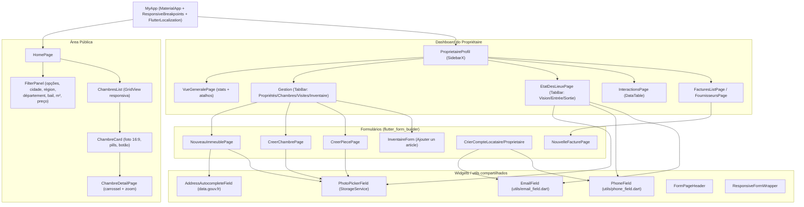
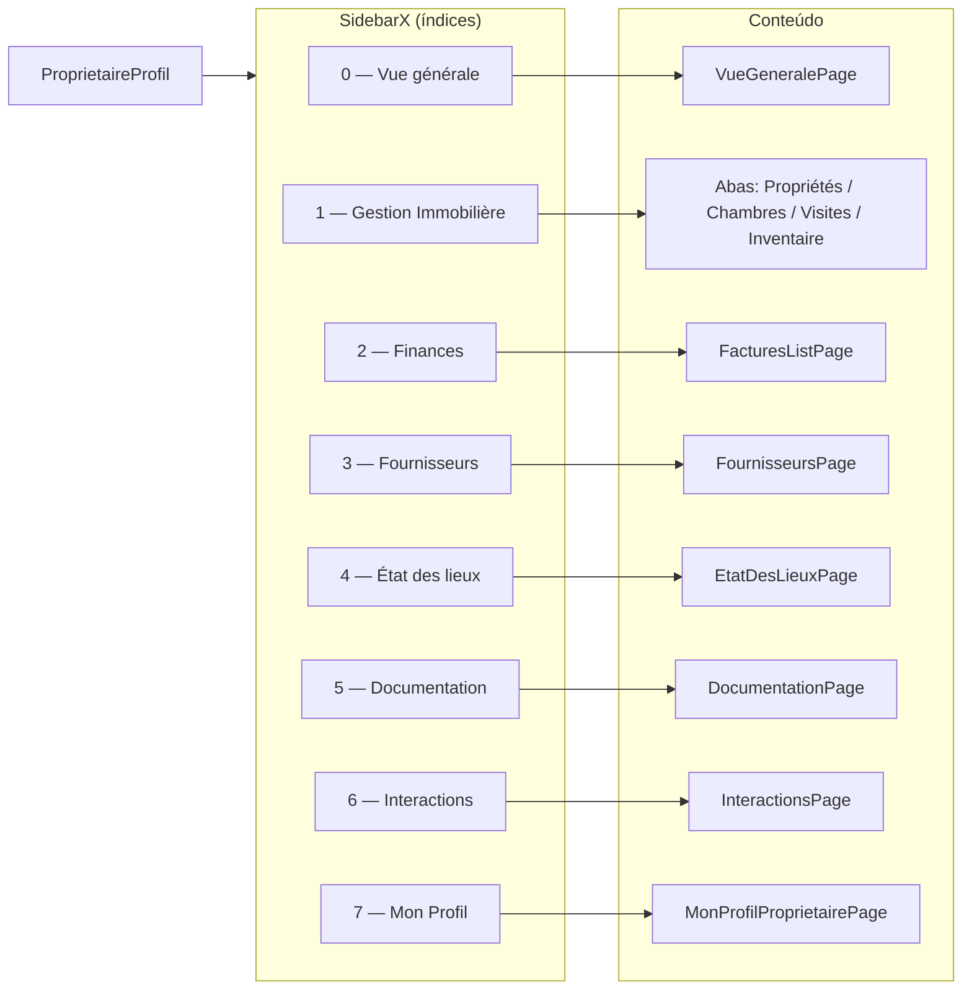
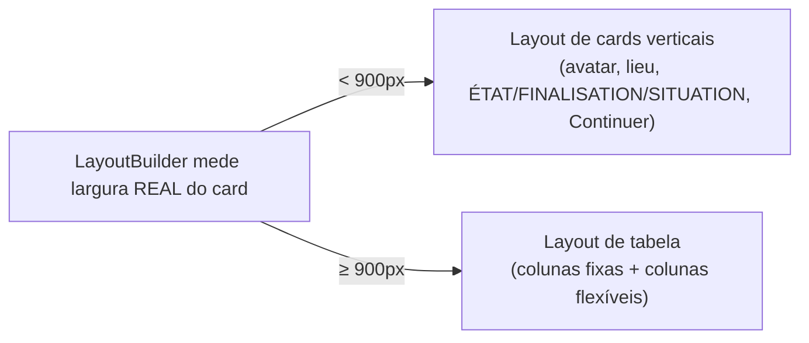
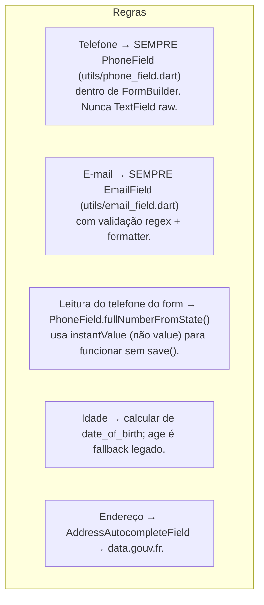
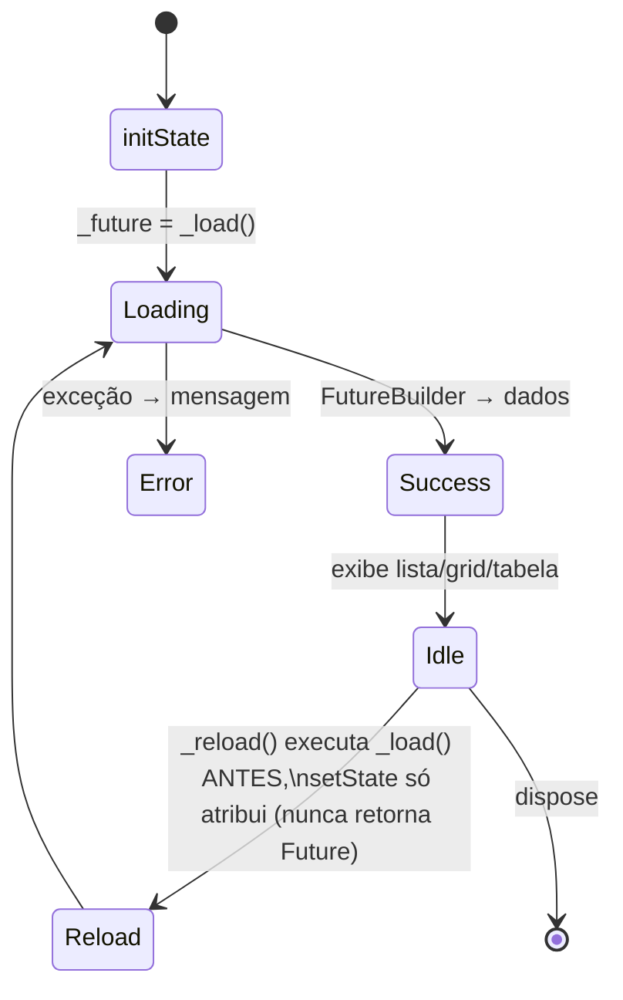

# Componentes de UI — La Coloc

## Hierarquia de Widgets Principais

---

## Estrutura do ProprietaireProfil (SidebarX)

---

## Padrão Responsivo das Tabelas (États des lieux)

- A decisão usa `LayoutBuilder` (largura do componente), nunca `MediaQuery` (largura da janela).
- Labels e valores usam `maxLines: 1` + `ellipsis` para nunca estourar (`RenderFlex overflow`).
- O botão "Nouveau" vira `IconButton.filled` compacto em tela estreita.

---

## Campos Padronizados (regras do projeto)

---

## Ciclo de Vida de Estado (StatefulWidget padrão)

> **Armadilha conhecida**: `setState(() => _future = _load())` faz o closure retornar
> um `Future` (Dart avalia a atribuição) → erro *"setState callback returned a Future"*.
> Sempre rodar `_load()` fora e atribuir num corpo de bloco: `setState(() { _future = f; });`.
