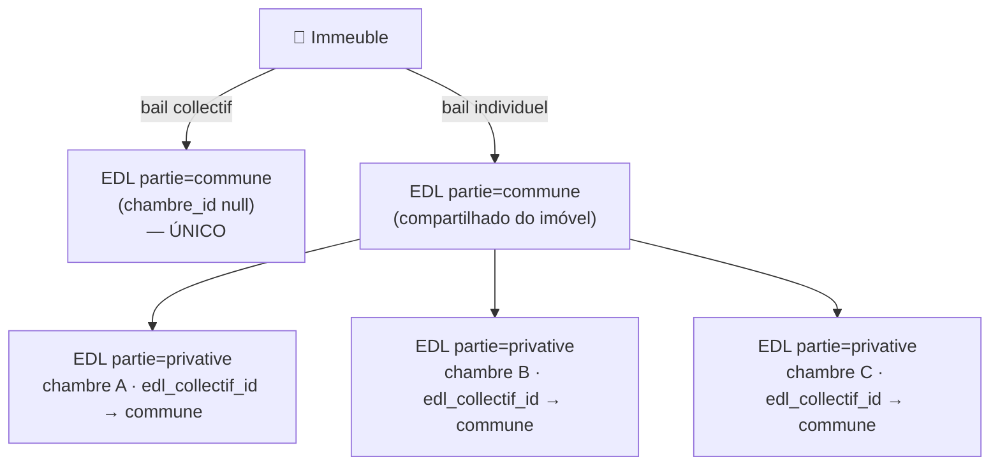
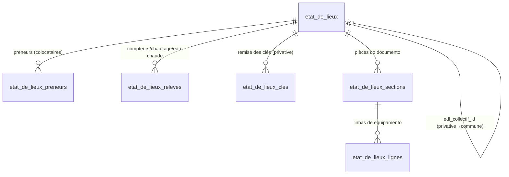
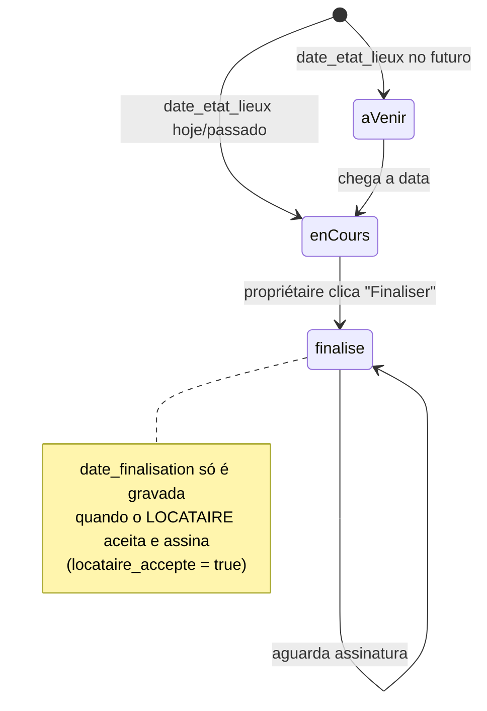
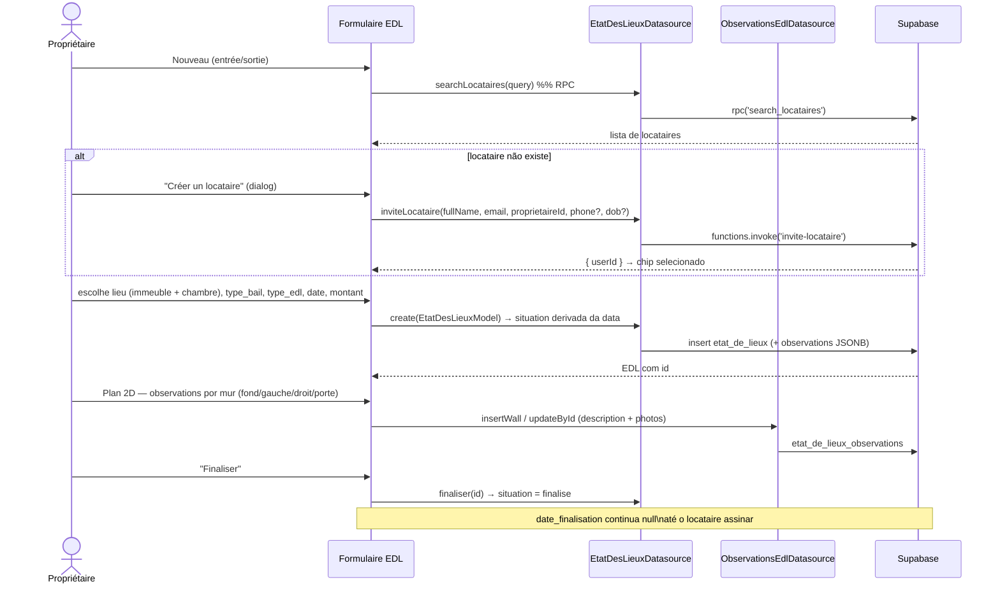
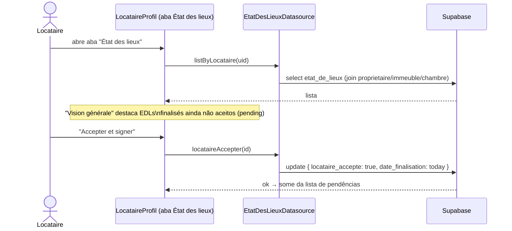
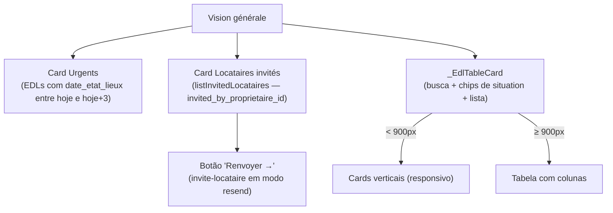
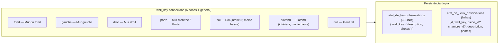
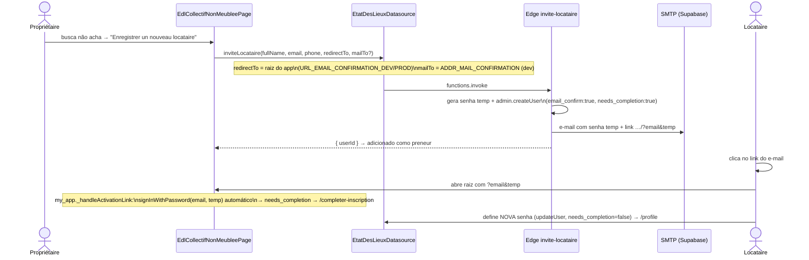

# État des Lieux (EDL) — Fluxo Completo

O état des lieux é o "contrato" entre propriétaire e locataire. Ele tem um **tipo**
(`entree` / `sortie`), um **tipo de bail** (`collectif` / `individuel`), uma
**partie** (`commune` / `privative`) e uma **situation** que evolui com o tempo.

> Modelos de referência (documentos reais preenchidos à mão) em [`../Maquettes/`](../Maquettes/):
> `edl partie commune` e `edl partie privée`.

## Partie commune × privative (vínculo collectif ↔ individuel)

- **Bail collectif** → existe **somente** o EDL `commune`.
- **Bail individuel** → 1 EDL `commune` por imóvel (parties communes) + 1 EDL
  `privative` por chambre/locataire, cada um apontando para o `commune` via
  `edl_collectif_id`.
- Datasource: `EtatDesLieuxDatasource.ensureCollectif()`, `findCollectif()`,
  `listPrivativesByCollectif()`.

## Estrutura de dados do documento (tabelas filhas)

| Tabela | Conteúdo no documento | Datasource |
|---|---|---|
| `etat_de_lieux_preneurs` | LE(S) PRENEUR(S) — nome + adresse | `EdlDetailsDatasource.*Preneur` |
| `etat_de_lieux_releves` | Compteurs eau/gaz/élec, chauffage, eau chaude | `*Releve` |
| `etat_de_lieux_cles` | REMISE DES CLÉS (type, nombre, date) | `*Cle` |
| `etat_de_lieux_sections` | Cada pièce (ENTREE, SEJOUR, CHAMBRE…) + commentaire global | `*Section` |
| `etat_de_lieux_lignes` | EQUIPEMENT · NATURE/NOMBRE · ÉTAT D'USURE · FONCTIONNEMENT · COMMENTAIRES | `*Ligne` |

`etat_usure`: `N` neuf · `B` bon état · `U` état d'usage · `M` mauvais.
As linhas de equipamento são alimentadas pelo `Inventaire` + estrutura da
chambre/immeuble, mais itens estruturais (SOL, MURs, PLAFOND, FENETRES…).

## Estados (`SituationEdl`)

| `SituationEdl` | `raw` (DB) | Label | Origem |
|---|---|---|---|
| `aVenir` | `a_venir` | À venir | `date_etat_lieux` futura |
| `enCours` | `en_cours` | En cours | data atingida, ainda editável |
| `finalise` | `finalise` | Finalisé | propriétaire finalizou |

---

## Ciclo de Vida — Propriétaire cria e finaliza

---

## Ciclo de Vida — Locataire aceita e assina

---

## Tab "Vision générale" (Propriétaire — `EtatDesLieuxPage`)

- **Urgents**: conta EDLs cuja `date_etat_lieux` cai entre hoje e hoje+3 dias.
- **Locataires invités**: vem de `list_invited_locataires` (RPC), filtrando por
  `invited_by_proprietaire_id`. Mostra coluna "E-mail envoyé" + botão "Renvoyer →".
- Após criar locataire pelo dialog, ele aparece como **chip** no formulário
  (avatar + nome + email + ×) e é imediatamente populado na tabela de invités.

---

## Observations (Plan 2D)

Cada observação tem `description` (texto livre) e `photos` (URLs do bucket `photos`).

### Plano de murs por pièce e por chambre (EDL collectif)

No fluxo **bail collectif**, o step **« État des pièces et chambres »** (após
« Composition ») mostra uma **lista expansível**: um item por **pièce** comum e um
por **chambre** do imóvel. Expandir um item revela o mesmo diagrama 2D de murs
(`_RoomDiagram`) daquela peça, com observações e fotos por mur + observação geral.

O escopo é feito por `etat_de_lieux_observations.piece_id` / `chambre_id`:

| Cenário | `piece_id` | `chambre_id` |
|---|---|---|
| Observação de uma pièce comum (collectif) | preenchido | null |
| Observação de uma chambre (collectif) | null | preenchido |
| EDL privatif (single-room) / observação geral | null | null |

O EDL **privatif** (bail individuel) mantém o step único « État de la chambre »
com observações de target null — comportamento inalterado.

### Novo fluxo "Nouveau EDL" — Collectif + non meublée

Ao clicar « Nouveau » em Vision générale / Entrée / Sortie:

1. Abre **`showSelectImmeubleDialog`** com a lista de imóveis (chips bail + meublée).
2. Se o imóvel é **bail collectif** e **`location_meuble = false`** → abre a página
   **`EdlCollectifNonMeubleePage`** (full-width):
   - Topo 3 colunas: **Bien** (nome, endereço, m², chips Collectif/Non meublée) ·
     **Locataires** · **Dates** (`date_etat_lieux`).
   - **Locataires**: campo de busca (`search_locataires`) cujos resultados são
     exibidos num **painel flutuante** (`OverlayPortal` + `CompositedTransformFollower`)
     que **não empurra** o resto da UI. O rodapé do painel sempre oferece
     **« Enregistrer un nouveau locataire »** (em destaque quando a busca não retorna
     nada) → abre o `_CreerLocataireDialog` (nom, e-mail, téléphone). Os preneurs
     adicionados aparecem em **cards compactos** (grade via `Wrap`, avatar + nom +
     e-mail) com botão **lixeira** (`CardDeleteButton`, widget padrão do tema).
     Persistidos em `etat_de_lieux_preneurs`. O e-mail vem do join `Users_Client`,
     com fallback num cache local (`_emailByLocataire`) caso a RLS bloqueie o embed.
   - Abaixo: lista expansível de pièces + chambres com o `_RoomDiagram` de **6
     zonas** (4 murs + plafond + sol). Observações escopadas via
     `piece_id`/`chambre_id` + `wall_key`. Ao expandir um item, a tela faz
     `Scrollable.ensureVisible` (após a animação) para trazê-lo ao topo; o header do
     accordeon tem cor distinta do corpo para sinalizar a área clicável.
3. Demais combinações (Individuel / Meublée) → SnackBar
   « Ce cas est en cours de développement » — a edição de EDLs existentes
   continua usando o stepper `_EdlFormOverlay`.

Schema: `etat_de_lieux.locataire_id` é **nullable** desde a migração
`etat_de_lieux_locataire_id_nullable` (collectif usa `preneurs`, sem locataire
principal).

### Criar locataire pelo EDL → e-mail de ativação → criação de senha

A senha temporária deixa de valer após a troca, então o **link não expira mas é
naturalmente de uso único**. O e-mail real do compte nunca muda; em dev o e-mail
é só **entregue** em `ADDR_MAIL_CONFIRMATION`.
