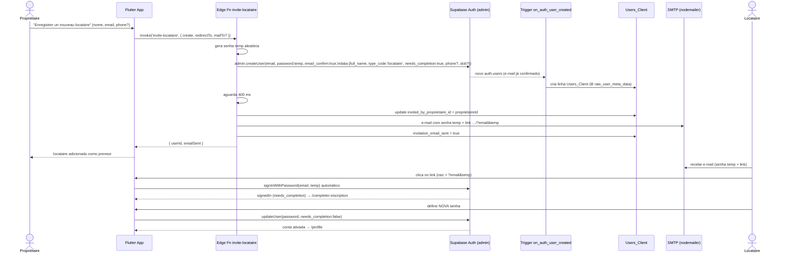
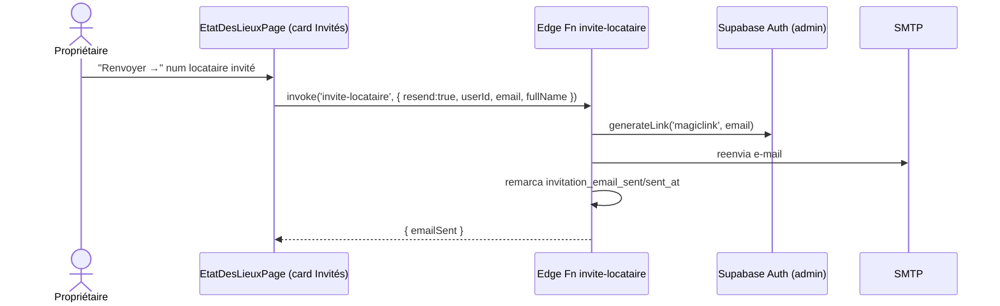
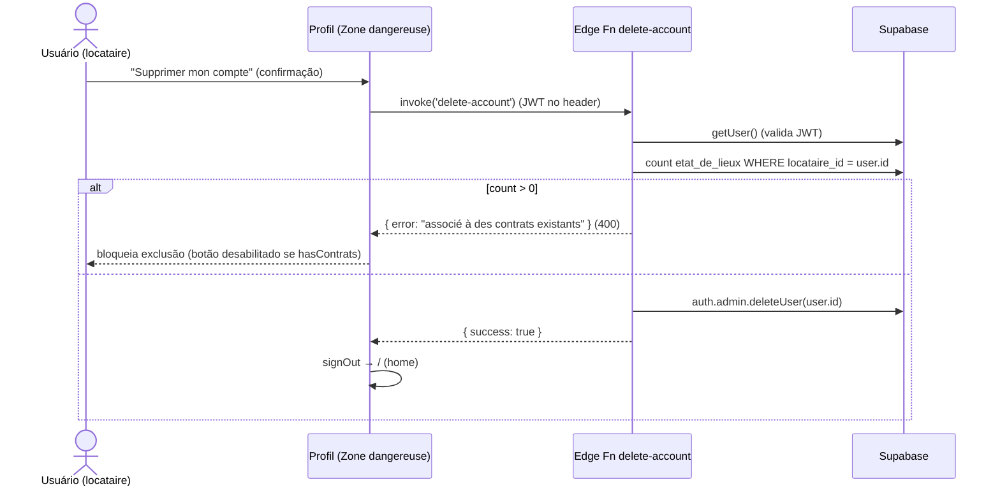

# Convite de Locataire & Edge Functions — La Coloc

## Edge Functions (Deno, `supabase/functions/`)

| Função | Modo | Entrada | Saída | Efeitos |
|---|---|---|---|---|
| `invite-locataire` | **create** | `fullName`, `email`, `proprietaireId`, `phone?`, `dateOfBirth?`, `redirectTo?`, `mailTo?` | `{ userId, emailSent, smtpError? }` | `admin.createUser` com **senha temp aleatória** + `email_confirm:true` + `needs_completion:true`; grava `invited_by_proprietaire_id`; envia e-mail SMTP com a senha temp + link `…/?email&temp`; marca `invitation_email_sent` |
| `invite-locataire` | **resend** | `resend: true`, `userId`, `email`, `fullName?`, `phone?`, `redirectTo?`, `mailTo?` | `{ emailSent, smtpError? }` | `admin.updateUserById` define **nova** senha temp (+ `needs_completion:true`); reenvia o link |
| `invite-locataire` | **test** | `test: true`, `email` | `{ emailSent, smtpConfigured, smtpError? }` | só envia e-mail de diagnóstico SMTP (não cria conta) |
| `delete-account` | — | (JWT no header) | `{ success }` ou `{ error }` | bloqueia se houver `etat_de_lieux` com `locataire_id` = usuário; senão `auth.admin.deleteUser` |
| `notify-proprietaire` | — | `fullName`, `email`, `phone?`, `note?` | best-effort | notifica admin sobre novo cadastro de propriétaire (chamada por `AuthService.notifyProprietaireRegistration`) |

> **Segredos usados pela `invite-locataire`**: `SMTP_HOST`, `SMTP_PORT`, `SMTP_USER`,
> `SMTP_PASS`, `SMTP_FROM`, `APP_URL`, `SUPABASE_URL`, `SUPABASE_SERVICE_ROLE_KEY`.
>
> **`redirectTo`** (novo): o cliente passa a URL da página de criação de senha no body
> da chamada. A edge function usa `redirectTo ?? APP_URL` no `generateLink`. O valor vem
> do `.env` do ambiente selecionado (`EtatDesLieuxDatasource._confirmationUrl`):
> `URL_EMAIL_CONFIRMATION_PROD` quando `EnvConfig.isProd`, senão `URL_EMAIL_CONFIRMATION_DEV`.
> O link de ação leva à verificação Supabase → redireciona para a URL (`/confirmation-locataire`);
> o listener em `my_app.dart` detecta `needs_completion` e abre `/completer-inscription`.
>
> **`mailTo`** (override de dev): em ambiente **dev**, `inviteLocataire` envia `mailTo =`
> `ADDR_MAIL_CONFIRMATION` (`.env.dev`). A edge function usa `recipient = mailTo ?? email`
> apenas como **destinatário do e-mail** — o compte é sempre criado com o e-mail real.
> Em prod (`ADDR_MAIL_CONFIRMATION` vazio) não há override.

---

## Fluxo de Convite (create)

---

## Fluxo de Reenvio (resend)

---

## Fluxo de Exclusão de Conta

> No `LocataireProfil`, o botão de exclusão já é desabilitado de antemão via
> `EtatDesLieuxDatasource.hasContratsLocataire(uid)` (UX otimista), e a edge function
> reforça a regra no servidor.

---

## RPCs (PostgreSQL `SECURITY DEFINER`)

| RPC | Parâmetros | Uso |
|---|---|---|
| `search_locataires` | `search_query` | Autocomplete de locataires no formulário de EDL |
| `list_invited_locataires` | `p_proprietaire_id` | Card "Locataires invités" (filtra `invited_by_proprietaire_id`) |

Ambas são chamadas via `supabase.rpc(...)` e retornam linhas compatíveis com
`UsersClient.fromJson`.
