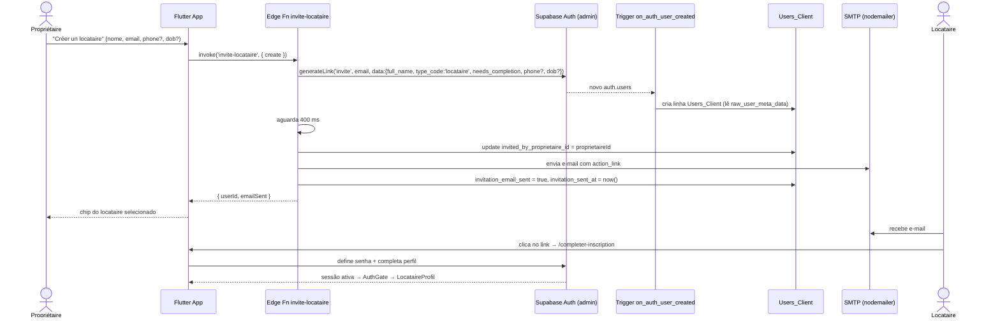
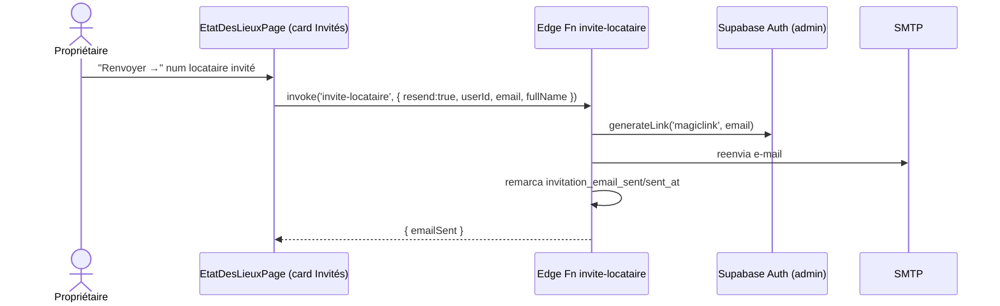
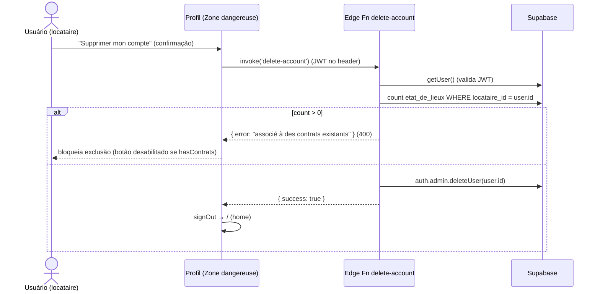

# Convite de Locataire & Edge Functions — La Coloc

## Edge Functions (Deno, `supabase/functions/`)

| Função | Modo | Entrada | Saída | Efeitos |
|---|---|---|---|---|
| `invite-locataire` | **create** | `fullName`, `email`, `proprietaireId`, `phone?`, `dateOfBirth?` | `{ userId, emailSent, smtpError? }` | `generateLink('invite')` → cria `auth.users`; aguarda 400 ms o trigger; grava `invited_by_proprietaire_id`; envia e-mail SMTP; marca `invitation_email_sent`/`invitation_sent_at` |
| `invite-locataire` | **resend** | `resend: true`, `userId`, `email`, `fullName`, `phone?` | `{ emailSent, smtpError? }` | `generateLink('magiclink')` → reenvia e-mail; remarca status |
| `delete-account` | — | (JWT no header) | `{ success }` ou `{ error }` | bloqueia se houver `etat_de_lieux` com `locataire_id` = usuário; senão `auth.admin.deleteUser` |
| `notify-proprietaire` | — | `fullName`, `email`, `phone?`, `note?` | best-effort | notifica admin sobre novo cadastro de propriétaire (chamada por `AuthService.notifyProprietaireRegistration`) |

> **Segredos usados pela `invite-locataire`**: `SMTP_HOST`, `SMTP_PORT`, `SMTP_USER`,
> `SMTP_PASS`, `SMTP_FROM`, `APP_URL`, `SUPABASE_URL`, `SUPABASE_SERVICE_ROLE_KEY`.
> O link de ação leva ao `APP_URL` → o app abre `/completer-inscription`.

---

## Fluxo de Convite (create)

---

## Fluxo de Reenvio (resend)

---

## Fluxo de Exclusão de Conta

> No `LocataireProfil`, o botão de exclusão já é desabilitado de antemão via
> `EtatDesLieuxDatasource.hasContratsLocataire(uid)` (UX otimista), e a edge function
> reforça a regra no servidor.

---

## RPCs (PostgreSQL `SECURITY DEFINER`)

| RPC | Parâmetros | Uso |
|---|---|---|
| `search_locataires` | `search_query` | Autocomplete de locataires no formulário de EDL |
| `list_invited_locataires` | `p_proprietaire_id` | Card "Locataires invités" (filtra `invited_by_proprietaire_id`) |

Ambas são chamadas via `supabase.rpc(...)` e retornam linhas compatíveis com
`UsersClient.fromJson`.
