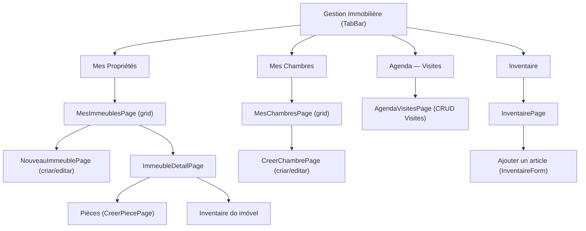
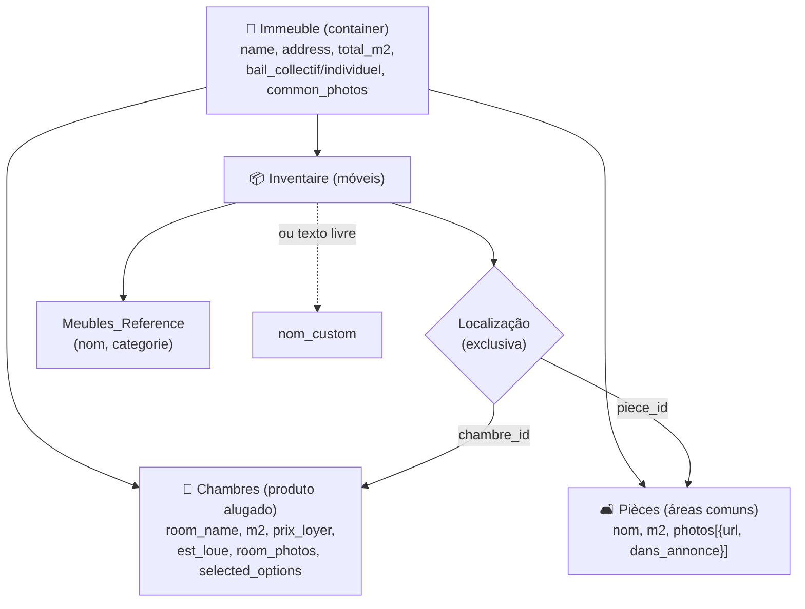
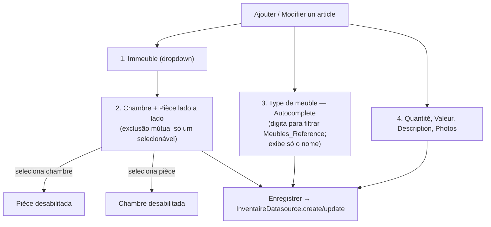
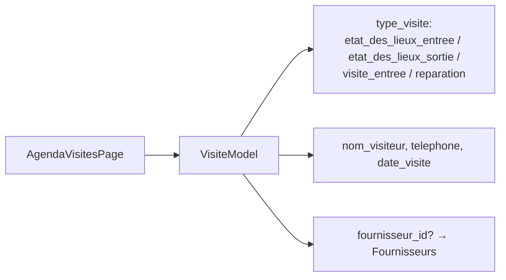

# Gestion Immobilière & Inventaire — La Coloc

A seção **Gestion Immobilière** (índice 1 do dashboard do propriétaire) é um `TabBar`
com 4 abas. O imóvel (`Immeuble`) é o container; o quarto (`Chambre`) é o produto
alugado; as `Pièces` são áreas comuns; o `Inventaire` cataloga os móveis.

---

## Hierarquia Immeuble → Chambre / Pièce / Inventaire

---

## Formulário "Ajouter un article" (Inventaire)

- O **tipo de meuble** é um campo de busca (`Autocomplete<MeubleReferenceModel>`):
  digita-se para filtrar a lista de `Meubles_Reference`; exibe apenas `nom`
  (a `categorie` é pesquisável mas não mostrada). A criação de novos tipos é feita
  pelo **Super Admin** em `MeubleTypesPage` (não há mais "saisir un nom libre" no form).
- **Chambre e Pièce** aparecem juntas após escolher o immeuble; selecionar uma
  desabilita a outra (`onChanged: null`). A opção "—" limpa a seleção.
- `nom_custom` ainda existe no modelo como fallback legado, mas o fluxo atual usa
  `meuble_ref_id`.

---

## Agenda — Visites

