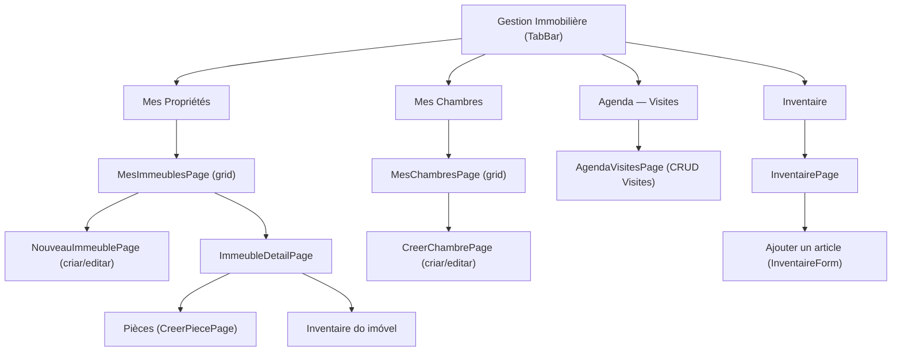
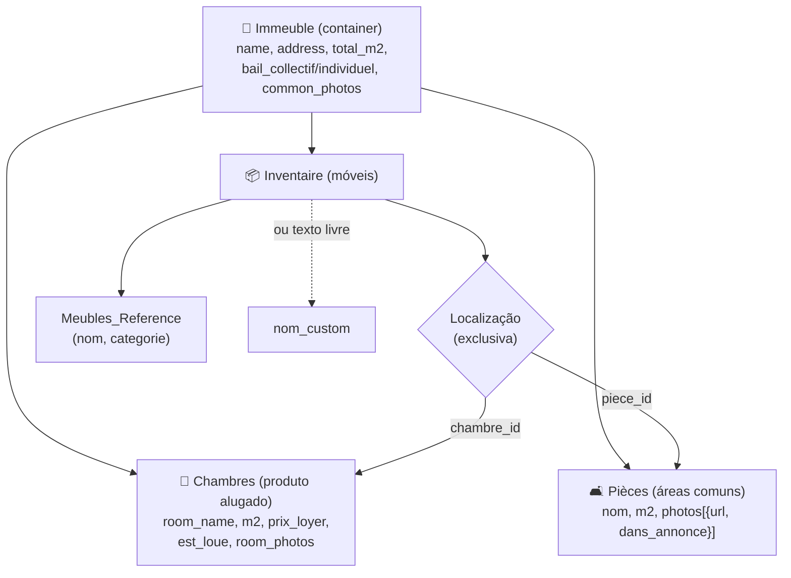
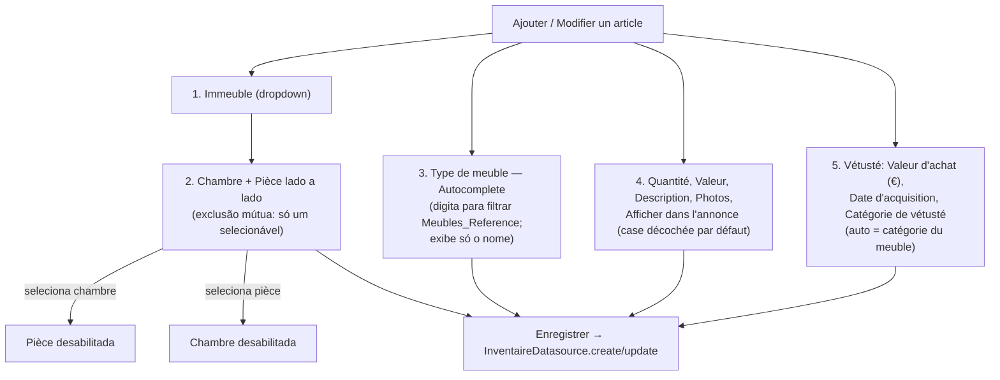
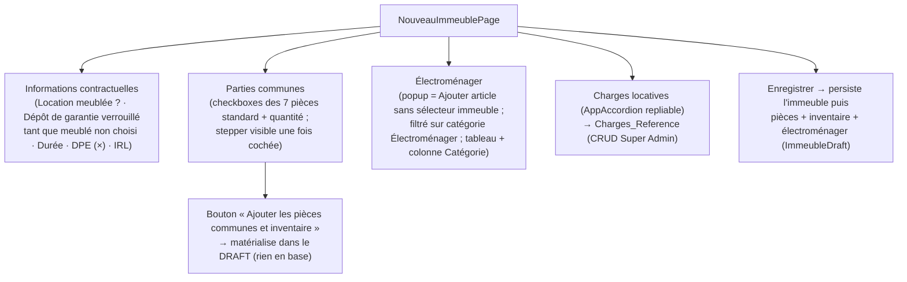
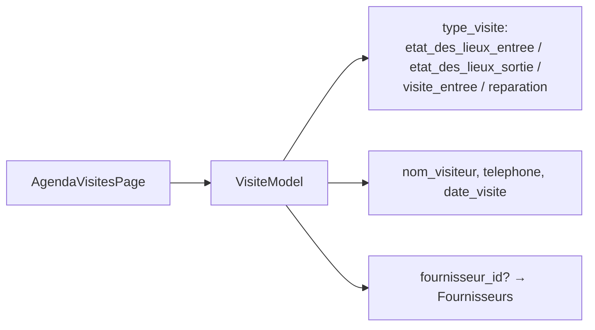

# Gestion Immobilière & Inventaire — Super Loc

A seção **Gestion Immobilière** (índice 1 do dashboard do propriétaire) é um `TabBar`
com 4 abas. O imóvel (`Immeuble`) é o container; o quarto (`Chambre`) é o produto
alugado; as `Pièces` são áreas comuns; o `Inventaire` cataloga os móveis.

```mermaid
graph TD
    GI["Gestion Immobilière (TabBar)"]
    GI --> T0["Mes Propriétés"]
    GI --> T1["Mes Chambres"]
    GI --> T2["Agenda — Visites"]
    GI --> T3["Inventaire"]

    T0 --> IMM["MesImmeublesPage (grid)"]
    IMM --> NIMM["NouveauImmeublePage (criar/editar)"]
    IMM --> IDET["ImmeubleDetailPage"]
    IDET --> PIECES["Pièces (CreerPiecePage)"]
    IDET --> INVI["Inventaire do imóvel"]

    T1 --> CH["MesChambresPage (grid)"]
    CH --> CCH["CreerChambrePage (criar/editar)"]

    T2 --> AG["AgendaVisitesPage (CRUD Visites)"]

    T3 --> INV["InventairePage"]
    INV --> ADD["Ajouter un article (InventaireForm)"]
```

---

## Hierarquia Immeuble → Chambre / Pièce / Inventaire

```mermaid
graph TD
    IMM["🏢 Immeuble (container)\nname, address, total_m2,\nbail_collectif/individuel, common_photos"]
    IMM --> CH["🚪 Chambres (produto alugado)\nroom_name, m2, prix_loyer,\nest_loue, room_photos"]
    IMM --> PC["🛋️ Pièces (áreas comuns)\nnom, m2, photos[{url, dans_annonce}]"]
    IMM --> INV["📦 Inventaire (móveis)"]

    INV --> LOC{"Localização\n(exclusiva)"}
    LOC -->|chambre_id| CH
    LOC -->|piece_id| PC

    INV --> REF["Meubles_Reference\n(nom, categorie)"]
    INV -.->|"ou texto livre"| CUSTOM["nom_custom"]
```

---

## Formulário "Ajouter un article" (Inventaire)

```mermaid
flowchart TD
    START["Ajouter / Modifier un article"]
    START --> IMMSEL["1. Immeuble (dropdown)"]
    IMMSEL --> LIEU["2. Chambre + Pièce lado a lado\n(exclusão mútua: só um selecionável)"]
    START --> TYPE["3. Type de meuble — Autocomplete\n(digita para filtrar Meubles_Reference;\nexibe só o nome)"]
    START --> QTY["4. Quantité, Valeur, Description, Photos,\nAfficher dans l'annonce (case décochée par défaut)"]
    START --> VET["5. Vétusté: Valeur d'achat (€),\nDate d'acquisition, Catégorie de vétusté\n(auto = catégorie du meuble)"]

    LIEU -->|seleciona chambre| LOCKP["Pièce desabilitada"]
    LIEU -->|seleciona pièce| LOCKC["Chambre desabilitada"]

    TYPE --> SAVE["Enregistrer → InventaireDatasource.create/update"]
    QTY --> SAVE
    LIEU --> SAVE
    VET --> SAVE
```

- O **tipo de meuble** é um campo de busca (`Autocomplete<MeubleReferenceModel>`):
  digita-se para filtrar a lista de `Meubles_Reference`; exibe apenas `nom`
  (a `categorie` é pesquisável mas não mostrada). A criação de novos tipos é feita
  pelo **Super Admin** em `MeubleTypesPage` (não há mais "saisir un nom libre" no form).
- **Chambre e Pièce** aparecem juntas após escolher o immeuble; selecionar uma
  desabilita a outra (`onChanged: null`). A opção "—" limpa a seleção.
- `nom_custom` ainda existe no modelo como fallback legado, mas o fluxo atual usa
  `meuble_ref_id`.
- **Campos de vétusté** (Option B): `valeur_achat` (preço de compra), `date_acquisition`
  e `categorie_vetuste`. A catégorie é herdada do meuble escolhido (editável para itens
  `nom_custom`) e serve de chave do `vetuste_bareme`. Esses campos alimentam o pré-preenchimento
  do « décompte de réparations » na sortie (ver [06_etat_des_lieux.md](06_etat_des_lieux.md)).
- **`dans_annonce`** (booleano, **decoché por defaut**): se `true`, o artigo aparece na
  **carte/fiche publique** da chambre. O **électroménager** (nível-immeuble) e os itens de
  **pièce** não aparecem na carte (a carte é por chambre).

### Équipements = Inventaire ligado à chambre

Os antigos « équipements » da chambre (`Chambres.selected_options` + `Options_Reference`:
Wifi, Douche, Lit double…) **migraram para `Inventaire`** (itens com `chambre_id` +
`dans_annonce=true`), catalogados em `Meubles_Reference` (categoria « Équipement »,
editável pelo Super Admin em `MeubleTypesPage`). O **`Chauffage` não é équipement** →
é uma **charge locative** (`Charges_Reference`, ao nível do immeuble).

- **Carte/fiche/filtre públicos** leem os nomes via RPC **`chambre_equipements_annonce`**
  (`SECURITY DEFINER`, só nomes — `Inventaire` permanece privado ao dono por RLS) →
  `InventaireDatasource.annonceLabelsByChambre` / `annonceEquipementNames`.
- **Filtro « Équipements »** (`FilterPanel`) passou a filtrar por **nome** (`ChambreFilter.equipements: Set<String>`).
- **EDL (auto-seed)**: itens com `chambre_id` → **EDL individuel (privatif)** ; itens de
  pièce/immeuble → **EDL collectif (parties communes)**.

### Liste d'inventaire (page)

- Barre de **recherche** + bouton **« Filtres »** standard (`FilterButton`, source de style
  unique) ouvrant un **popover** (`OverlayPortal`) avec **Immeuble** + **Catégorie**.
- Colonnes : **Article · Catégorie · Immeuble · Lieu · Qté · Valeur** (+ icône 🏪 « affiché
  dans l'annonce »).

---

## Cadastro do imóvel — Pièces communes, Électroménager & Charges (draft)

```mermaid
flowchart TD
    NEW["NouveauImmeublePage"] --> CONTRA["Informations contractuelles\n(Location meublée ? · Dépôt de garantie verrouillé\ntant que meublé non choisi · Durée · DPE (×) · IRL)"]
    NEW --> PC["Parties communes\n(checkboxes des 7 pièces standard + quantité ;\nstepper visible une fois cochée)"]
    PC --> GEN["Bouton « Ajouter les pièces communes et inventaire »\n→ matérialise dans le DRAFT (rien en base)"]
    NEW --> ELEC["Électroménager\n(popup = Ajouter article sans sélecteur immeuble ;\nfiltré sur catégorie Électroménager ; tableau + colonne Catégorie)"]
    NEW --> CH["Charges locatives (AppAccordion repliable)\n→ Charges_Reference (CRUD Super Admin)"]
    NEW --> SAVE["Enregistrer → persiste l'immeuble puis\npièces + inventaire + électroménager (ImmeubleDraft)"]
```

- **Modelo draft** (`ImmeubleDraft`, `lib/data/models/immeuble_draft.dart`): mantém em memória
  as pièces selecionadas e os électroménagers; nada vai ao banco até « Enregistrer »
  (equivalente a um « Formik » para as coleções; os campos escalares ficam no `flutter_form_builder`).
- A quantidade N numa pièce cria **N pièces** (« WC 1 », « WC 2 »…) com seu inventário.
- O **accordéon** reutilizável `AppAccordion` (`lib/theme/app_accordion.dart`) é o padrão dos menus
  suspensos (ex. Charges locatives, Barème de vétusté).
- **Dépôt de garantie**: ao escolher « Location meublée ? », o campo é **pré-preenchido com o
  máximo legal** (2 meses meublé / 1 mês non-meublé), editável.
- **Seed sépare l'électroménager** (`CommonsSeeder`): cada item gerado é confrontado com
  `Meubles_Reference` ; se casar (Four, Micro-ondes, Lave-vaisselle…) é ligado via
  **`meuble_ref_id`** (que carrega a categoria « Électroménager ») em vez de `nom_custom` →
  électroménager fica catalogado, não texto livre.
- **Ajouter un électroménager em EDIÇÃO**: como o immeuble já existe, o item é criado
  **direto no inventaire do immeuble** (`InventaireDatasource.createMany`) e listado na sessão
  (antes a seção só mostrava uma nota).
- **Tooltips « ? »** (`fieldHelpIcon`) nos campos **Valeur** (valor atual/de reposição) vs
  **Valeur d'achat — vétusté** (preço de compra p/ o cálculo de vétusté).

### Statut d'une chambre (phases)
`ChambreStatut` (`lib/data/models/chambre_statut.dart`) derivado do EDL d'**entrée** privatif :
**Libre** (sem EDL) → **EDL d'entrée en cours** (não finalizado) → **En attente de signature**
(finalizado, locataire não assinou) → **Bail signé · Louée** (locataire assinou). O badge na fiche
do immeuble usa `EtatDesLieuxDatasource.entreePrivatifsByImmeuble`.

### Supprimer une chambre
`ChambresDatasource.delete(id)` apaga o inventário ligado (`deleteByChambre`) + a chambre.
Como `Chambres.immeuble_id` é **NOT NULL**, « détacher » não existe → botão na **fiche do
immeuble** (lixeira por linha) e no **cadastro da chambre** (edição) ambos apagam do sistema.
« Ajouter chambre » na fiche do immeuble abre o cadastro com o immeuble pré-selecionado e
volta à fiche depois.

---

## Agenda — Visites

```mermaid
graph LR
    AG["AgendaVisitesPage"] --> V["VisiteModel"]
    V --> TY["type_visite:\netat_des_lieux_entree / etat_des_lieux_sortie /\nvisite_entree / reparation"]
    V --> VIS["nom_visiteur, telephone, date_visite"]
    V --> FRN["fournisseur_id? → Fournisseurs"]
```
