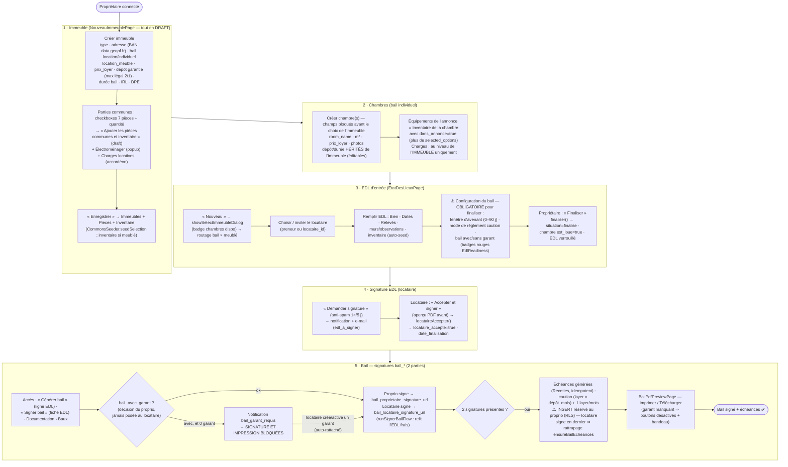
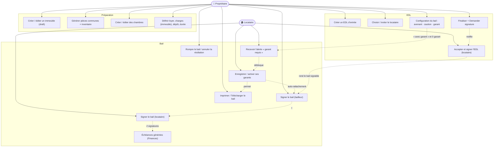
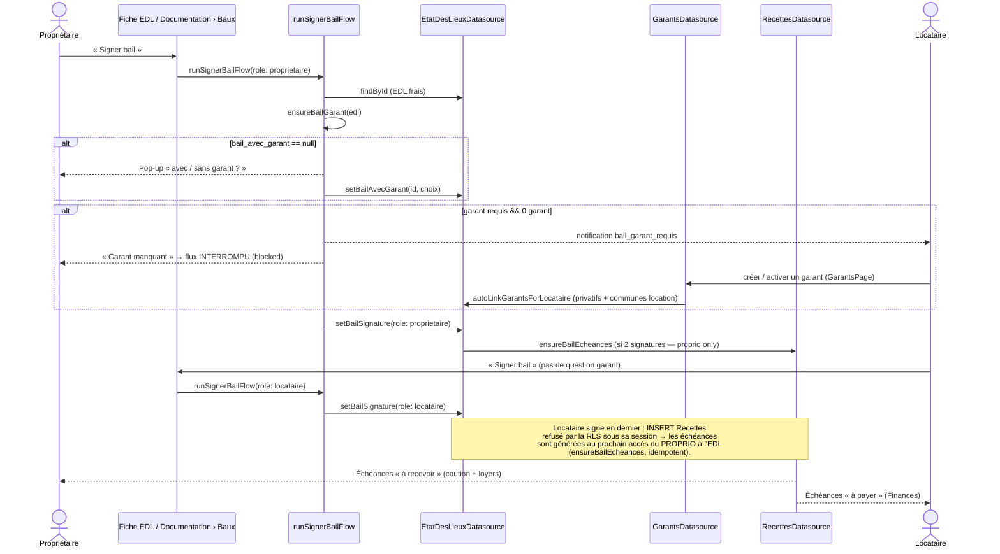

# Do Immeuble ao Bail — Fluxo Completo

Este documento descreve **tudo o que é necessário** para chegar a um **contrat de
bail** assinado e às **échéances** geradas, partindo da criação do imóvel. O bail
**não é criado manualmente**: ele é **gerado a partir de um EDL d'entrée aceito
pelo locataire**, e consolidado com os dados do imóvel, da chambre, das charges e
dos garants. O EDL e o bail são **dois documentos distintos**, com **assinaturas
independentes** (colunas EDL vs colunas `bail_*`).

> Relacionados: [06_etat_des_lieux.md](06_etat_des_lieux.md) (ciclo do EDL),
> [10_parcours_location.md](10_parcours_location.md) (parcours por ator),
> [08_gestion_inventaire.md](08_gestion_inventaire.md) (pièces/inventaire),
> [12_finances_recettes.md](12_finances_recettes.md) (échéances),
> [02_modelo_de_dados.md](02_modelo_de_dados.md) (ERD).

---

## 1. Organograma — caminho completo (proprietaire + locataire)

---

## 2. Pré-requisitos (o que é « nécessaire »)

| Etapa | Obrigatório | Onde | Tabela/Campo |
|---|---|---|---|
| **Immeuble** | type, adresse, bail (`bail_location`/`bail_individuel`), `location_meuble` | NouveauImmeublePage | `Immeubles` |
| | prix_loyer (location), dépôt garantie, durée bail, IRL, DPE (recomendados p/ bail completo) | idem | `Immeubles.prix_loyer / depot_garantie_mois / duree_bail_mois / irl_reference / dpe_classe` |
| **Pièces communes + inventaire** | seleção de pièces no draft → `CommonsSeeder.seedSelection()` no save (inventaire só se meublé) | seção Parties communes do cadastro | `Pieces`, `Inventaire` |
| **Chambre** (bail individuel) | room_name; prix_loyer; dépôt/durée herdados do imóvel (editáveis) | CreerChambrePage | `Chambres` |
| **Charges** | opcional — **só ao nível do immeuble** (a chambre herda; fallback `BailPdfData.useChambreCharges` p/ legado) | cadastro do immeuble (accordéon) | `ImmeubleCharges` |
| **EDL d'entrée** | locataire (preneur/`locataire_id`) + preenchimento | EtatDesLieuxPage | `etat_de_lieux` |
| **Configuration du bail** | **fenêtre d'avenant** + **mode caution** + **choix garant** — sem os 3, « Finaliser » é bloqueado (`EdlReadiness`) | fiche EDL (onglet/section Bail) | `avenant_window_days`, `caution_mode`/`caution_details`, `bail_avec_garant` |
| **Garant** (se « avec ») | ≥ 1 garant ativo rattaché **por locataire com conta** (bail location: per-preneur via `etat_de_lieux_garants`); auto-rattachement ao criar/ativar | fiche EDL + GarantsPage (locataire) | `Garants`, `etat_de_lieux_garants` |
| **Finalização** | proprietaire « Finaliser » → `situation=finalise`, chambre `est_loue=true` | fiche EDL | `etat_de_lieux.situation` |
| **Aceitação EDL** | locataire « Accepter et signer » (aperçu PDF antes) → `date_finalisation` | espace locataire | `etat_de_lieux.locataire_accepte` |
| **Assinaturas do BAIL** | bailleur **e** locataire — colunas **`bail_*`**, distintas das assinaturas do EDL | « Signer bail » (fiche EDL / Documentation › Baux) | `bail_proprietaire_signature_url`, `bail_locataire_signature_url` + `bail_*_signed_at` |
| **Échéances** | geradas automaticamente na 2ª assinatura do bail (idempotente; INSERT só do proprietaire → rattrapage `ensureBailEcheances`) | automático | `Recettes` (caution + loyers, statut `a_recevoir`) |
| **Impressão** | garant presente se exigido (≥ 1) | BailPdfPreviewPage | gate `BailPdfData.garantManquant` |

> **Caution / dépôt de garantie**: o valor é `loyer HC × depot_garantie_mois`
> (Article 4.4 do bail) e vira uma **échéance própria** em `Recettes` (notes
> « Dépôt de garantie (caution) ») exigível no início do bail. O **modo de
> règlement** (`caution_mode` + détails) é obrigatório antes de finalizar.

---

## 3. Diagrama de casos de uso (Immeuble → Bail)

---

## 4. Diagrama de sequência (assinatura do bail + échéances)

---

## 5. Regras de edição após finalização

- Um EDL **finalisé** (`situation = finalise`) **não é mais editável**: o botão
  **« Continuer »** desaparece da tabela (Vision générale / Entrée / Sortie). Só
  restam **« œil » (Visualiser)** e, quando aplicável, **« Avenant »**.
- Um EDL finalisé **não pode ser suprimido**. Ao suprimir o **último privatif**
  de um contrato, o collectif órfão (não finalisé) é suprimido **atomicamente
  por trigger DB** (`trg_delete_orphan_collectif`).
- Para um novo locataire numa chambre livre de um collectif finalizado: **Avenant**
  (ver [06_etat_des_lieux.md](06_etat_des_lieux.md)).
- Durante a **janela de avenant/additions** (`avenant_window_days`, escolhida por
  EDL), ambas as partes podem registrar **additions** na fiche do EDL individuel.
- **Résiliation**: « Rompre le bail » exige o bail assinado pelo locataire;
  registra congé + préavis, calcula a fin effective e **remove as échéances
  futuras**. « Annuler la résiliation » limpa o congé e **restaura** as échéances
  removidas (`regenerateMissingInstallments`).
