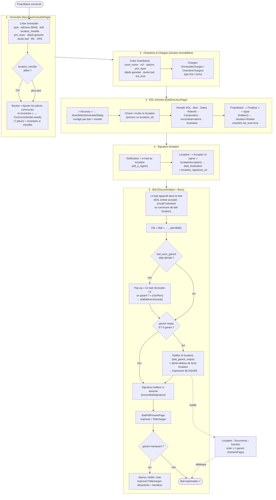
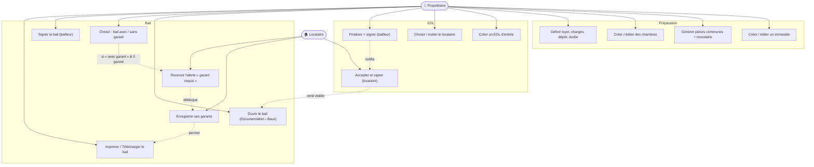
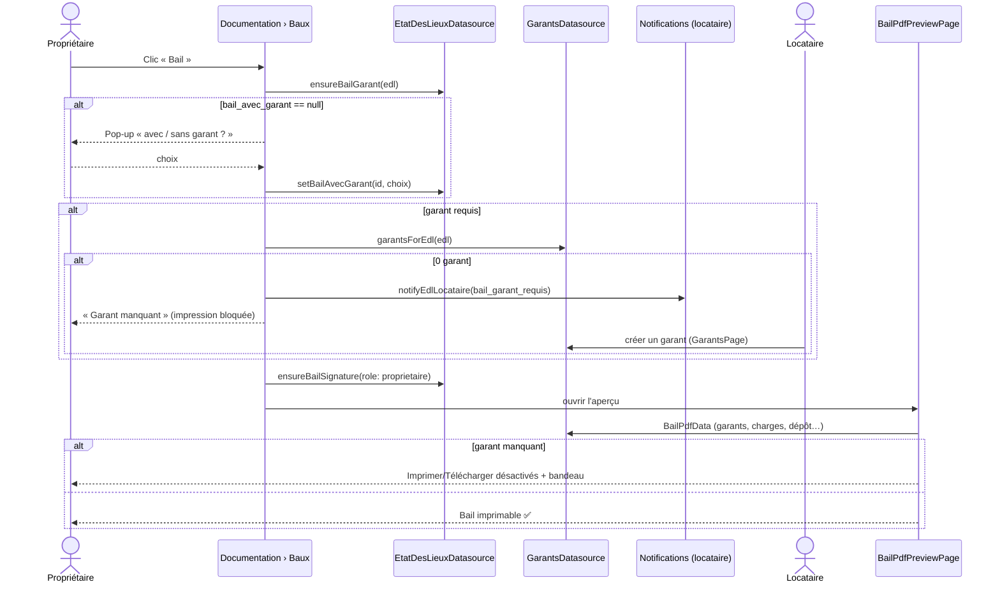

# Do Immeuble ao Bail — Fluxo Completo

Este documento descreve **tudo o que é necessário** para chegar a um **contrat de
bail** imprimível, partindo da criação do imóvel. O bail **não é criado
manualmente**: ele é **gerado a partir de um EDL d'entrée aceito e assinado pelo
locataire**, e consolidado com os dados do imóvel, da chambre, das charges e dos
garants.

> Relacionados: [06_etat_des_lieux.md](06_etat_des_lieux.md) (ciclo do EDL),
> [08_gestion_inventaire.md](08_gestion_inventaire.md) (pièces/inventaire),
> [02_modelo_de_dados.md](02_modelo_de_dados.md) (ERD).

---

## 1. Organograma — caminho completo (proprietaire + locataire)

---

## 2. Pré-requisitos (o que é « necessaire »)

| Etapa | Obrigatório | Onde | Tabela/Campo |
|---|---|---|---|
| **Immeuble** | type, adresse, bail (`bail_location`/`bail_individuel`), `location_meuble` | NouveauImmeublePage | `Immeubles` |
| | prix_loyer (location), dépôt garantie, durée bail, IRL, DPE (recomendados p/ bail completo) | idem | `Immeubles.prix_loyer / depot_garantie_mois / duree_bail_mois / irl_reference / dpe_classe` |
| **Pièces communes + inventaire** | gerados via `CommonsSeeder.seed()` (precisa `location_meuble`) | botão no cadastro do imóvel | `Pieces`, `Inventaire` |
| **Chambre** (bail individuel) | room_name; prix_loyer/dépôt/durée na chambre (senão herda do imóvel) | CreerChambrePage | `Chambres` |
| **Charges** | opcional (fixe/inclus) — entram no detalhe do bail | Gestion Immobilière | `ImmeubleCharges` / `ChambreCharges` |
| **EDL d'entrée** | locataire (preneur/`locataire_id`) + finalização + assinatura | EtatDesLieuxPage | `etat_de_lieux` |
| **Finalização** | proprietaire « Finaliser » (assina) → `situation=finalise`, chambre `est_loue=true` | fiche EDL | `etat_de_lieux.situation` |
| **Aceitação** | locataire « Accepter et signer » → `date_finalisation` + `locataire_signature_url` | espace locataire | `etat_de_lieux.locataire_accepte` |
| **Bail visível** | EDL **entrée** + `locataire_accepte = true` (privatif individuel OU commune de bail location) | Documentation › Baux | — |
| **Garant** (se exigido) | proprietaire escolhe `bail_avec_garant=true` → locataire cadastra ≥ 1 garant | pop-up + GarantsPage | `etat_de_lieux.bail_avec_garant`, `Garants` |
| **Assinaturas no bail** | bailleur (`proprietaire_signature_url`) + locataire (`locataire_signature_url`) | fluxo de assinatura | `etat_de_lieux.*_signature_url` |
| **Impressão** | garant presente se exigido (≥ 1) | BailPdfPreviewPage | gate `BailPdfData.garantManquant` |

> **Caution / dépôt de garantie**: hoje é apenas um **valor calculado**
> (`loyer HC × depot_garantie_mois`) exibido no Article 4.4 do bail. Não há
> rastreamento de depósito efetivamente pago/devolvido.

---

## 3. Diagrama de casos de uso (Immeuble → Bail)

---

## 4. Diagrama de sequência (geração + impressão do bail)

---

## 5. Regras de edição após finalização

- Um EDL **finalisé** (`situation = finalise`) **não é mais editável**: o botão
  **« Continuer »** desaparece da tabela (Vision générale / Entrée / Sortie). Só
  restam **« œil » (Visualiser)** e, quando aplicável, **« Avenant »**.
- Para um novo locataire numa chambre livre de um collectif finalizado: **Avenant**
  (ver [06_etat_des_lieux.md](06_etat_des_lieux.md)).
- Durante a **janela de avenant/additions**, ambas as partes podem registrar
  **additions** (algo não verificado) na fiche do EDL individuel.
