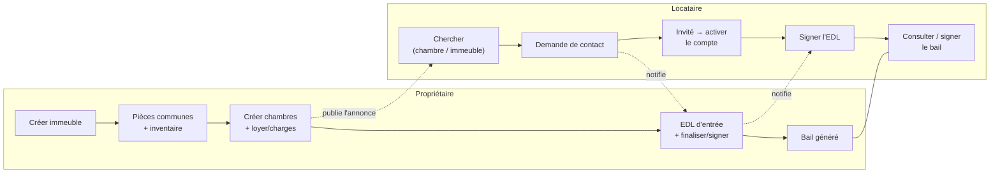
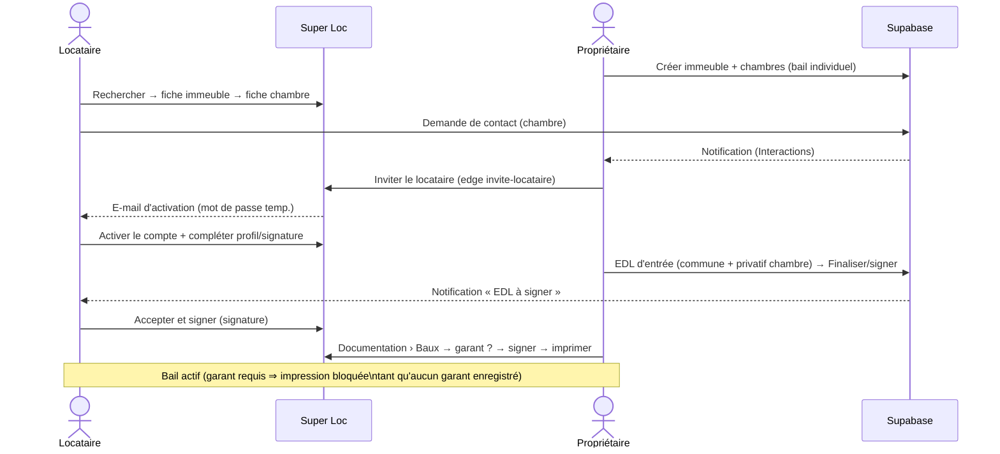
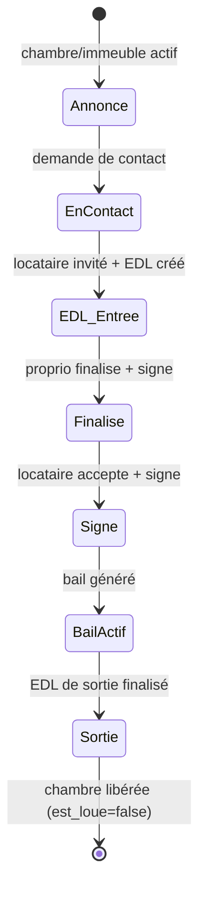

# Parcours de location — Locataire & Propriétaire (flux + cas d'usage)

Ce document détaille, **par acteur**, le chemin complet pour louer :
- **Locataire** : trouver et louer une **colocation** (bail individuel) ou une
  **location** simple (non colocation).
- **Propriétaire** : de la **création de l'immeuble** jusqu'au **bail signé**.

> Voir aussi : [09_immeuble_vers_bail.md](09_immeuble_vers_bail.md) (détails BD du
> bail), [06_etat_des_lieux.md](06_etat_des_lieux.md) (cycle de l'EDL),
> [01_casos_de_uso.md](01_casos_de_uso.md) (cas d'usage généraux).

---

## 1. Vue d'ensemble — deux acteurs, un même bien



---

## 2. Locataire — Colocation (bail individuel) vs Location (simple)

La différence clé : en **colocation** l'unité louée est **une chambre** (EDL
privatif lié à un EDL commune partagé) ; en **location simple** l'unité est **le
logement entier** (un seul EDL « location », plusieurs preneurs possibles mais un
seul contrat).

```mermaid
flowchart TD
    START([Visiteur / Locataire]) --> SEARCH["Parcourir « Rechercher location »\n(chambres) ou « Immeubles »"]
    SEARCH --> FILTER["Filtrer : ville, prix, surface,\nmeublé, équipements, charges…"]
    FILTER --> KIND{"Type de bien ?"}

    %% Colocation
    KIND -->|Colocation\n(bail individuel)| C1["Ouvrir la fiche immeuble\n→ voir les chambres dispo"]
    C1 --> C2["Ouvrir la fiche d'une chambre"]
    C2 --> C3["« Entrer en contact »\n(Demande de contact)"]

    %% Location simple
    KIND -->|Location simple\n(non colocation)| S1["Ouvrir la fiche immeuble\n(logement entier)"]
    S1 --> S2["« Entrer en contact »"]

    C3 --> CONTACT
    S2 --> CONTACT["Le propriétaire est notifié\n(Interactions)"]
    CONTACT --> INVITE["Propriétaire crée/invite le locataire\n(edge invite-locataire)"]
    INVITE --> ACT["Locataire active son compte\n(mot de passe + profil)"]
    ACT --> CHECK["Checklist « Conditions pour louer » :\nprofil · signature · garant (si requis)"]
    CHECK --> EDL["EDL d'entrée finalisé par le proprio\n→ « Accepter et signer »"]
    EDL --> BAIL["Consulter / signer le bail\n(garant requis ⇒ impression bloquée\ntant qu'aucun garant)"]
    BAIL --> END([Locataire installé ✅])
```

### Cas d'usage — Locataire

```mermaid
graph TD
    L(["🏠 Locataire / Visiteur"])
    subgraph Recherche
        U1["Parcourir chambres"]
        U2["Parcourir immeubles + fiche détail"]
        U3["Filtrer (ville, prix, meublé, équipements…)"]
        U4["Voir le détail d'une chambre"]
    end
    subgraph Contact_Compte["Contact & compte"]
        U5["Entrer en contact (demande)"]
        U6["Activer le compte (invitation)"]
        U7["Compléter le profil"]
        U8["Enregistrer sa signature"]
        U9["Enregistrer un garant (si requis)"]
    end
    subgraph Contrat
        U10["Accepter et signer l'EDL"]
        U11["Consulter / signer le bail"]
        U12["Recevoir messages & alertes\n(tableau de bord)"]
    end
    L --> U1 & U2 & U3 & U4
    L --> U5 & U6 & U7 & U8 & U9
    L --> U10 & U11 & U12
```



---

## 3. Propriétaire — de l'immeuble au bail

```mermaid
flowchart TD
    START([Propriétaire]) --> READY["Checklist « Conditions pour louer » :\nprofil · signature · immeuble · chambre"]
    READY --> IMM["Créer immeuble\n(type, adresse BAN, bail, meublé,\nloyer, dépôt, durée, IRL, DPE)"]
    IMM --> BAILK{"Type de bail ?"}

    BAILK -->|Location simple| LOC["1 logement = 1 contrat\n(plusieurs preneurs possibles)"]
    BAILK -->|Colocation\n(bail individuel)| COL["Créer les chambres\n(1 locataire / chambre)"]

    LOC --> COMMONS["Pièces communes + inventaire\n(CommonsSeeder)"]
    COL --> COMMONS
    COMMONS --> CHARGES["Charges (fixe / inclus)\nimmeuble ou chambre"]
    CHARGES --> PUBLISH["Annonce visible\n(chambres / immeuble actifs)"]

    PUBLISH --> DEMANDE["Recevoir une demande de contact\n→ inviter le locataire"]
    DEMANDE --> EDL["Créer l'EDL d'entrée\n(location ⇒ 1 commune ;\ncolocation ⇒ 1 commune + 1 privatif/chambre)"]
    EDL --> FIN["Finaliser + signer (bailleur)\n→ chambre est_loue=true"]
    FIN --> SIGN["Locataire accepte et signe\n→ date_finalisation"]
    SIGN --> BAIL["Ouvrir le bail (Documentation › Baux)\n→ choix garant → signer → imprimer"]
    BAIL --> SORTIE["Plus tard : EDL de sortie\n(à partir de l'entrée finalisée)"]
    SORTIE --> END([Contrat clôturé])
```

### Cas d'usage — Propriétaire

```mermaid
graph TD
    P(["🏢 Propriétaire"])
    subgraph Patrimoine
        U1["Créer / éditer immeuble"]
        U2["Générer pièces communes + inventaire"]
        U3["Créer / éditer chambres"]
        U4["Définir loyer, charges, dépôt, durée"]
        U5["Agenda des visites"]
    end
    subgraph Relation
        U6["Voir les demandes de contact"]
        U7["Inviter un locataire"]
    end
    subgraph Contrat
        U8["Créer un EDL d'entrée"]
        U9["Finaliser + signer"]
        U10["Générer / signer / imprimer le bail"]
        U11["Créer un avenant / EDL de sortie"]
        U12["Gérer finances (factures / recettes)"]
    end
    P --> U1 & U2 & U3 & U4 & U5
    P --> U6 & U7
    P --> U8 & U9 & U10 & U11 & U12
```



---

## 4. Séquence — Colocation (de la recherche au bail)



---

## 5. États du bien / contrat


