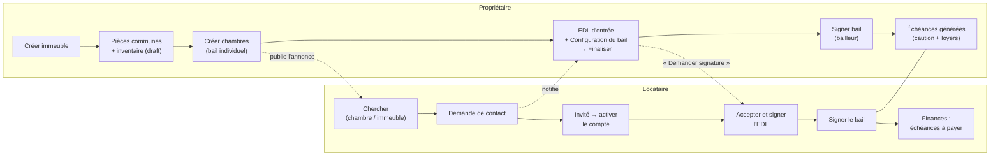
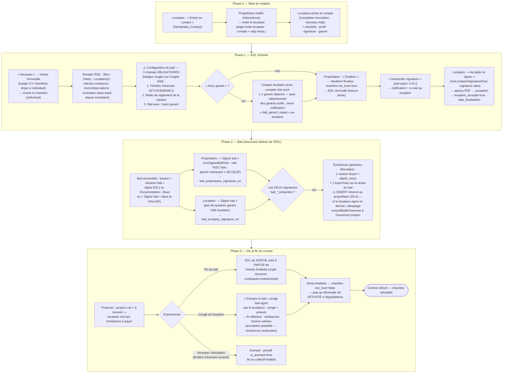
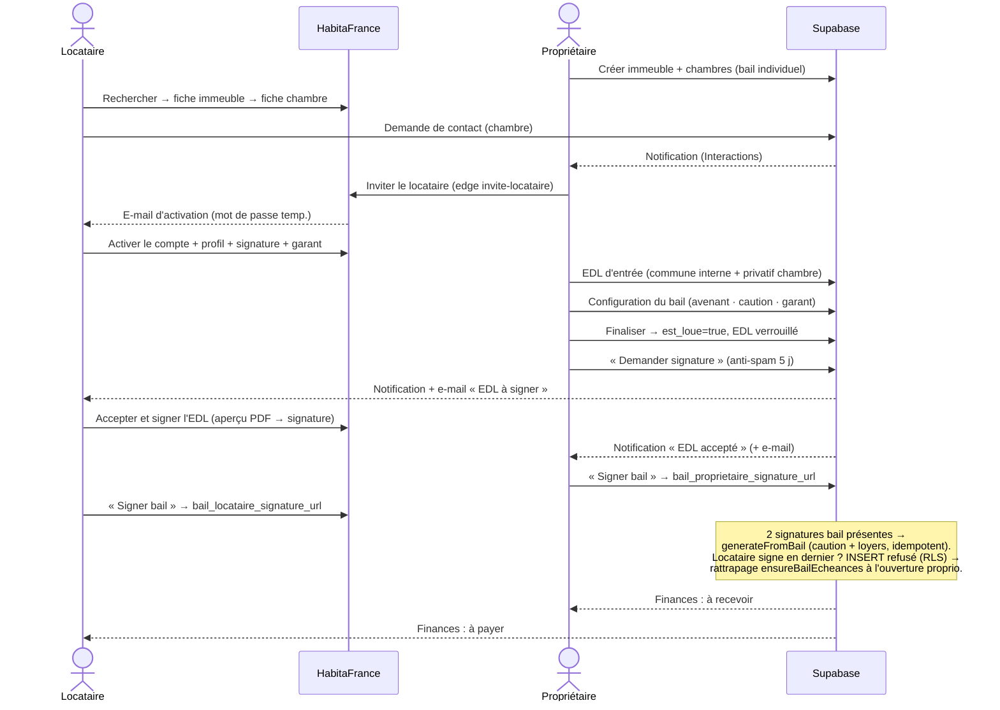
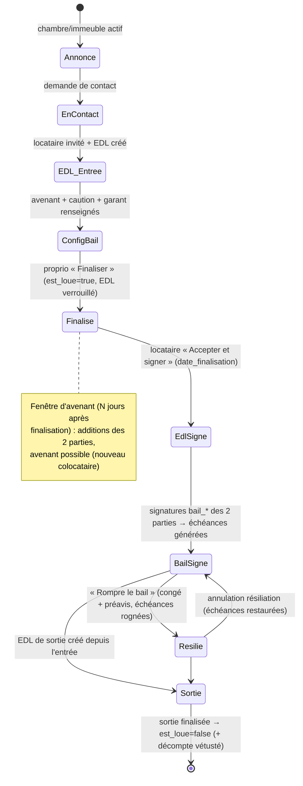

# Parcours de location — Locataire & Propriétaire (flux + cas d'usage)

Ce document détaille, **par acteur**, le chemin complet pour louer :
- **Propriétaire** : de la **création de l'immeuble** (puis des chambres) jusqu'au
  **bail signé des deux parties** et aux **échéances** générées.
- **Locataire** : trouver et louer une **colocation** (bail individuel) ou une
  **location** simple (non colocation).

> Voir aussi : [09_immeuble_vers_bail.md](09_immeuble_vers_bail.md) (détails BD du
> bail), [06_etat_des_lieux.md](06_etat_des_lieux.md) (cycle de l'EDL),
> [12_finances_recettes.md](12_finances_recettes.md) (échéances),
> [01_casos_de_uso.md](01_casos_de_uso.md) (cas d'usage généraux).

---

## 1. Vue d'ensemble — deux acteurs, un même bien

Deux documents distincts, signés séparément : l'**EDL** (état des lieux) puis le
**bail** (contrat). Les échéances (caution + loyers) ne sont générées que quand
le **bail** est signé des **deux** côtés.



---

## 2. Propriétaire — créer l'immeuble, puis les chambres

Tout le cadastro do imóvel é feito em **draft** (`ImmeubleDraft`) : nada vai ao
banco antes do « Enregistrer ».

```mermaid
flowchart TD
    START([Propriétaire connecté]) --> NEW["« Nouveau » (Mes Propriétés)\n→ NouveauImmeublePage"]

    subgraph DRAFT["Draft (rien en BD avant « Enregistrer »)"]
        NEW --> BASE["Informations de base :\ntype (dropdown) · nom · adresse (autocomplete BAN\ndata.geopf.fr → ville/dept/région/code postal)\n· m² · description · photos communes"]
        BASE --> BAILT{"Type de bail ?"}
        BAILT -->|"bail_location\n(« Location » : 1 contrat, N preneurs)"| CONTR
        BAILT -->|"bail_individuel\n(« Colocation » : 1 contrat / chambre)"| CONTR
        CONTR["Informations contractuelles :\nmeublé ? (Oui/Non) · prix loyer ·\ndépôt de garantie (max légal 2 mois vide / 1 meublé) ·\ndurée du bail · classe DPE · référence IRL"]
        CONTR --> COMMONS["Parties communes : checkboxes des 7 pièces types\n(Séjour, Entrée, Cuisine, Arrière-cuisine,\nBalcon, Salle de bain, WC) + quantité\n→ « Ajouter les pièces communes et inventaire »\n(matérialisé dans le DRAFT)"]
        COMMONS --> ELECTRO["Électroménager (popup « Ajouter article »\nfiltré catégorie Électroménager) → draft"]
        ELECTRO --> CHRG["Charges locatives (accordéon AppAccordion,\ncatalogue Charges_Reference) — NIVEAU IMMEUBLE\n(les chambres héritent, plus de charges par chambre)"]
    end

    CHRG --> SAVE["« Enregistrer »\n(_ensureLocationData complète ville/dept/CP si absents)"]
    SAVE --> DB[("Immeubles + Pieces\n+ Inventaire (CommonsSeeder.seedSelection ;\ninventaire des pièces seulement si meublé)")]

    DB --> KIND{"Bail ?"}
    KIND -->|location| ANNONCE
    KIND -->|individuel| CH["Créer les chambres\n(CreerChambrePage)"]

    subgraph CHAMBRE["Chambre (unité louée en colocation)"]
        CH --> CH1["Choisir l'immeuble\n(champs BLOQUÉS avant ce choix)"]
        CH1 --> CH2["room_name · m² · prix loyer ·\ndescription · photos"]
        CH2 --> CH3["Dépôt de garantie + durée bail :\nPRÉ-REMPLIS depuis l'immeuble (éditables)"]
        CH3 --> CH4["Statut : louée / désactivée\n(pas de section équipements → Inventaire ;\npas de charges → immeuble)"]
        CH4 --> INV["Équipements de l'annonce =\narticles d'Inventaire liés à la chambre\navec dans_annonce = true"]
    end

    INV --> ANNONCE(["Annonce publique visible\n(HomePage : chambres actives / immeuble actif)"])
```



**Points clés :**
- Le type de bail de l'**immeuble** décide de toute la suite : `bail_location`
  → un seul contrat pour le logement ; `bail_individuel` → une chambre = un
  contrat (colocation).
- La chambre **hérite** dépôt/durée de l'immeuble (pré-remplis, éditables) ;
  les **charges** vivent au niveau de l'immeuble ; les **équipements** affichés
  dans l'annonce sont les articles d'`Inventaire` de la chambre avec
  `dans_annonce=true` (RPC publique `chambre_equipements_annonce`).

---

## 3. Flux de location complet (le contrat, pas à pas)

C'est LE flux central du système. Trois grandes phases : **EDL** → **bail** →
**échéances / vie du contrat**.



**Règles à retenir :**

| Étape | Règle |
|---|---|
| Finaliser l'EDL | Impossible tant que **fenêtre d'avenant**, **mode caution** et **choix garant** ne sont pas renseignés (`EdlReadiness`, badges rouges). |
| « Avec garant » | Chaque locataire **avec compte** doit avoir ≥ 1 garant rattaché (`etat_de_lieux_garants`). En bail location, le rattachement est **par preneur**. Le garant créé/activé par le locataire est **auto-rattaché** (privatifs + communes location). |
| Signatures | EDL et bail sont **deux documents** : signatures EDL (`locataire_accepte` + signatures EDL) ≠ signatures bail (`bail_*_signature_url`). |
| Échéances | Générées **une seule fois** (idempotent) quand les 2 signatures bail existent. Montant = `EDL.montant` sinon loyer chambre/immeuble. |
| Occupation | Entrée **finalisée** → `est_loue=true` ; sortie **finalisée** → `est_loue=false`. |
| Suppression | EDL finalisé : jamais supprimable. Dernier privatif supprimé → collectif orphelin supprimé **par trigger DB** (`trg_delete_orphan_collectif`). |

---

## 4. Locataire — Colocation (bail individuel) vs Location (simple)

La différence clé : en **colocation** l'unité louée est **une chambre** (EDL
privatif lié à un EDL commune partagé, invisible dans les listes) ; en
**location simple** l'unité est **le logement entier** (un seul EDL « location »,
plusieurs preneurs possibles mais un seul contrat).

```mermaid
flowchart TD
    START([Visiteur / Locataire]) --> SEARCH["Parcourir « Rechercher location »\n(chambres) ou « Immeubles »"]
    SEARCH --> FILTER["Filtrer : ville, prix, surface,\nmeublé, équipements, type d'immeuble…"]
    FILTER --> KIND{"Type de bien ?"}

    %% Colocation
    KIND -->|Colocation\n(bail individuel)| C1["Ouvrir la fiche immeuble\n→ voir les chambres dispo"]
    C1 --> C2["Ouvrir la fiche d'une chambre"]
    C2 --> C3["« Entrer en contact »\n(Demande de contact)"]

    %% Location simple
    KIND -->|Location simple\n(non colocation)| S1["Ouvrir la fiche immeuble\n(logement entier)"]
    S1 --> S2["« Entrer en contact »"]

    C3 --> CONTACT
    S2 --> CONTACT["Le propriétaire est notifié\n(Interactions)"]
    CONTACT --> INVITE["Propriétaire crée/invite le locataire\n(edge invite-locataire)"]
    INVITE --> ACT["Locataire active son compte\n(mot de passe + profil)"]
    ACT --> CHECK["Checklist « Conditions pour louer » :\nprofil · signature · garant (obligatoire)"]
    CHECK --> EDL["EDL d'entrée finalisé par le proprio\n→ « Accepter et signer »\n(aperçu PDF avant d'accepter)"]
    EDL --> BAIL["« Signer bail » (signature du profil)\n— 2e signature ⇒ échéances générées"]
    BAIL --> FIN["Menu Finances : caution + loyers\nà payer ; Documents › Mes baux :\nconsulter le bail signé"]
    FIN --> END([Locataire installé ✅])
```

### Cas d'usage — Locataire

```mermaid
graph TD
    L(["🏠 Locataire / Visiteur"])
    subgraph Recherche
        U1["Parcourir chambres"]
        U2["Parcourir immeubles + fiche détail"]
        U3["Filtrer (ville, prix, meublé, équipements…)"]
        U4["Voir le détail d'une chambre"]
    end
    subgraph Contact_Compte["Contact & compte"]
        U5["Entrer en contact (demande)"]
        U6["Activer le compte (invitation)"]
        U7["Compléter le profil"]
        U8["Enregistrer sa signature"]
        U9["Enregistrer / activer un garant\n(auto-rattaché aux baux « avec garant »)"]
    end
    subgraph Contrat
        U10["Accepter et signer l'EDL\n(aperçu PDF avant)"]
        U11["Signer le bail (bail_*)"]
        U12["Ajouter des observations / additions\n(fenêtre d'avenant)"]
        U13["Consulter ses baux (Documents › Mes baux)"]
        U14["Payer les échéances (Finances)"]
        U15["Recevoir notifications (Interactions)\n+ tableau de bord (pendências)"]
    end
    L --> U1 & U2 & U3 & U4
    L --> U5 & U6 & U7 & U8 & U9
    L --> U10 & U11 & U12 & U13 & U14 & U15
```



---

## 5. Cas d'usage — Propriétaire

```mermaid
graph TD
    P(["🏢 Propriétaire"])
    subgraph Patrimoine
        U1["Créer / éditer immeuble\n(draft : contractuel, pièces, électro, charges)"]
        U2["Générer pièces communes + inventaire\n(seedSelection, si meublé)"]
        U3["Créer / éditer chambres\n(hérite dépôt/durée)"]
        U4["Gérer l'inventaire (dans_annonce)"]
        U5["Agenda : rendez-vous (créneaux)\n+ plages d'ouverture"]
    end
    subgraph Relation
        U6["Voir les demandes de contact"]
        U7["Inviter un locataire (edge fn)"]
    end
    subgraph Contrat
        U8["Créer un EDL d'entrée\n(+ copie parties communes d'un\ncontrat précédent, au choix)"]
        U9["Configuration du bail :\navenant · caution · garant"]
        U10["Finaliser + Demander signature"]
        U11["Signer le bail (bailleur)"]
        U12["Rompre le bail (congé + préavis)\n/ annuler la résiliation"]
        U13["Créer un avenant / EDL de sortie"]
        U14["Décompte de vétusté (sortie)"]
    end
    subgraph Finances
        U15["Recettes : échéances générées,\nmarquer payé/impayé"]
        U16["Dépenses / Factures · Fournisseurs"]
    end
    P --> U1 & U2 & U3 & U4 & U5
    P --> U6 & U7
    P --> U8 & U9 & U10 & U11 & U12 & U13 & U14
    P --> U15 & U16
```



---

## 6. Séquence — Colocation (de la recherche aux échéances)



---

## 7. États du bien / contrat


