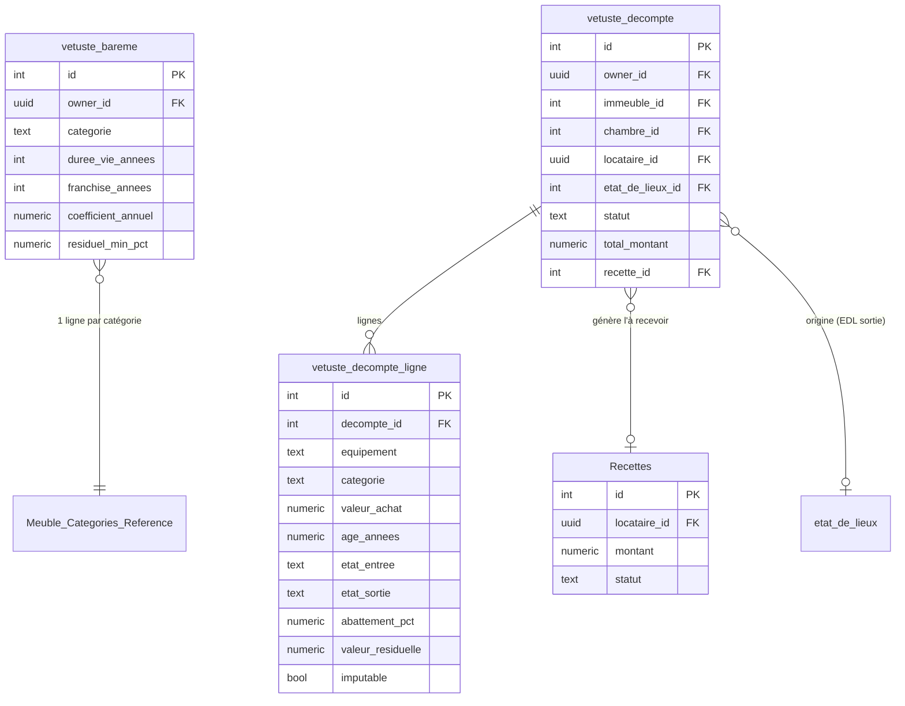
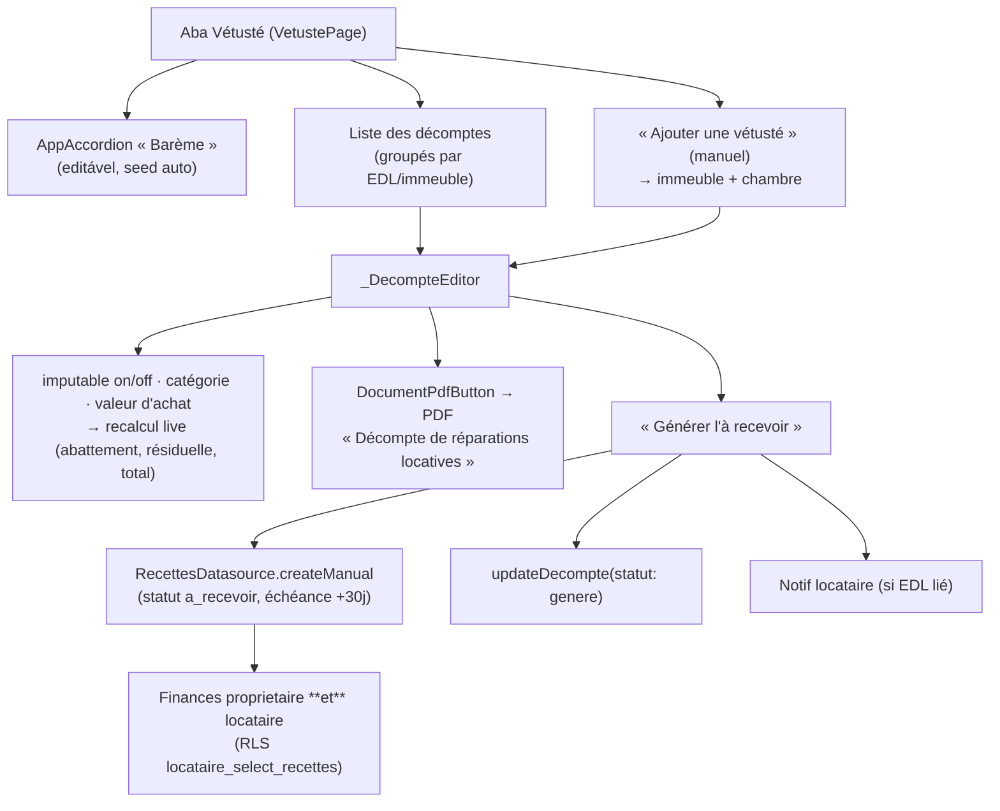

# Vétusté & Décompte de réparations locatives (Option B)

> Mécanique complète : barème par proprietaire → détection des dégradations à la
> sortie → décompte calculé → document PDF → somme « à recevoir » (Finances).
> Code : [vetuste_page.dart](../lib/presentation/users/proprietaires/vetuste_page.dart),
> [vetuste.dart (datasource)](../lib/data/datasources/vetuste.dart),
> [vetuste_calc.dart](../lib/utils/vetuste_calc.dart),
> [vetuste_pdf_builder.dart](../lib/presentation/users/proprietaires/vetuste_pdf_builder.dart).

## Modèle de données



- O barème é chaveado pela **catégorie de meuble** (`Meuble_Categories_Reference.nom`).
  `Inventaire.categorie_vetuste` (ou a categoria do `meuble_ref`) decide qual linha usar.

## Fórmula (décret 2016-382)

```
abattement%        = clamp((âge − franchise) × coefficient_annuel, 0, 100 − residuel_min_pct)
valeur_résiduelle  = valeur_achat × (1 − abattement%/100)
```

`VetusteCalc.abattementPct` / `valeurResiduelle`. `âge` = (date sortie − `date_acquisition`) en années.

## Fluxo — détection à la sortie

```mermaid
sequenceDiagram
    actor P as Propriétaire
    participant PG as EDL sortie (page)
    participant DS as VetusteDatasource
    participant DB as Supabase

    P->>PG: Finaliser (EDL type_edl = sortie)
    PG->>DS: buildCandidatesForSortie(sortie)
    DS->>DB: listSections(sortie) + listSections(edl_entree_id)
    DB-->>DS: lignes (etat_usure)
    DS->>DS: compara N<B<U<M ; retém dégradations\n+ pré-remplit via Inventaire (valeur_achat/date/cat)
    DS-->>PG: candidats (lignes calculées)
    alt candidats non vides
        PG->>P: Pop-up « Dégradation détectée — créer la vétusté ? »
        P->>PG: Oui
        PG->>DS: createDecompteFromSortie (idempotent: findByEdl)
        DS->>DB: insert vetuste_decompte + lignes
    end
```

## Fluxo — décompte → à recevoir



## Saisie des données nécessaires

- **Inventaire** (formulaire d'article + popup électroménager) : `valeur_achat`, `date_acquisition`,
  `categorie_vetuste`. Ver [08_gestion_inventaire.md](08_gestion_inventaire.md).
- **EDL** : `etat_usure` (N/B/U/M) par ligne d'équipement, à l'entrée puis à la sortie.
  Ver [06_etat_des_lieux.md](06_etat_des_lieux.md).

## RLS

- `vetuste_bareme` / `vetuste_decompte` / `vetuste_decompte_ligne` : propriétaire (`owner_id`).
- Leitura locataire em `vetuste_decompte`/`_ligne` (via `locataire_id` ou `is_edl_preneur`).
- `Recettes` : `owner_all_recettes` + `locataire_select_recettes` (a somme à recevoir aparece para o locataire).

> Ciclo de vida do « à recevoir » (statuts, markPaid/markLate) : ver
> [12_finances_recettes.md](12_finances_recettes.md). Notificação ao locataire :
> ver [13_notifications.md](13_notifications.md).
