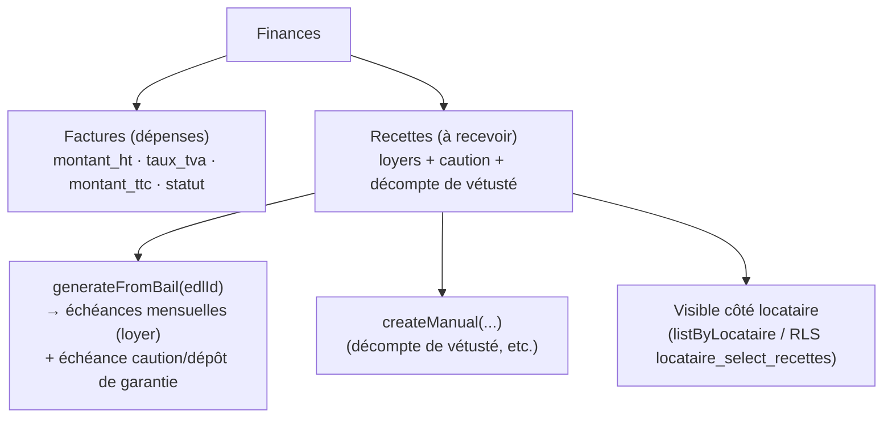
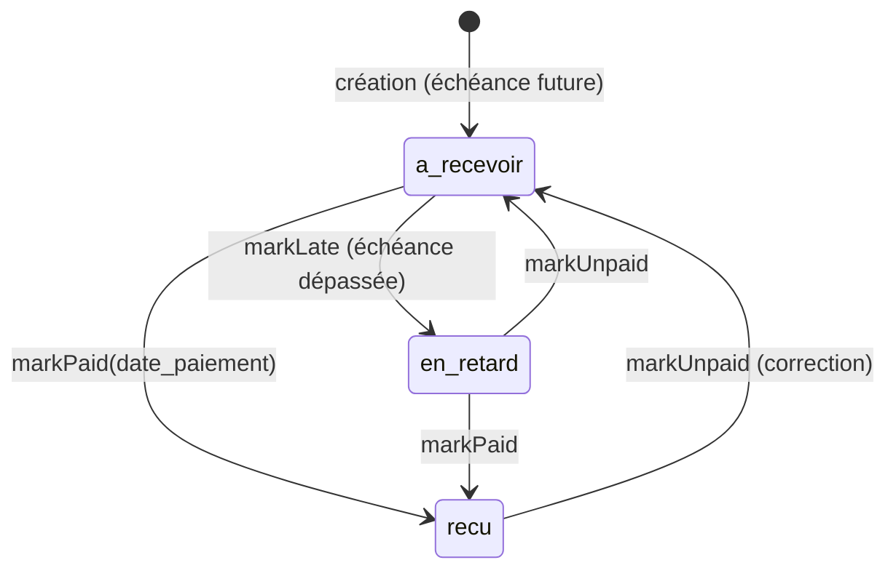

# Finances — Factures & Recettes (à recevoir)

> Seção **Finances** do proprietaire (`FacturesListPage`: factures + recettes) e
> menu **Finances** do locataire (`_FinancesSection` — recettes que lhe concernem).
> Code : [recettes.dart](../lib/data/datasources/recettes.dart),
> [factures.dart](../lib/data/datasources/factures.dart).

## Visão geral

## Origem das recettes

- **`generateFromBail(edlId)`** — a partir de um EDL d'**entrée finalisé + accepté**, gera
  as **échéances mensuelles** do loyer (idempotente : não duplica se já existirem) e a
  **échéance de caution** (dépôt de garantie, `depot_garantie_mois × loyer`).
- **`createManual(...)`** — échéance avulsa ; usada pelo **décompte de vétusté**
  (« Générer l'à recevoir », ver [11_vetuste.md](11_vetuste.md)) e por ajustes manuais.
- **`deleteFutureInstallments(...)`** — limpa échéances futuras (ex. ao refazer o bail).

## Ciclo de vida de uma recette (`statut`)

- `a_recevoir` (défaut) · `recu` (com `date_paiement`) · `en_retard`.
- Leituras: `listByOwner(ownerId)` (proprietaire), `listByLocataire(locataireId)` e
  `listByEdl(edlId)`. Cache via `CacheKeys.recettes`.

## RLS

- `owner_all_recettes` : tudo onde `owner_id = auth.uid()`.
- `locataire_select_recettes` : leitura onde `locataire_id = auth.uid()` **ou**
  `is_edl_preneur(etat_de_lieux_id)` — assim a somme à recevoir (loyer/caution/vétusté)
  aparece automaticamente em **Finances** do locataire.
