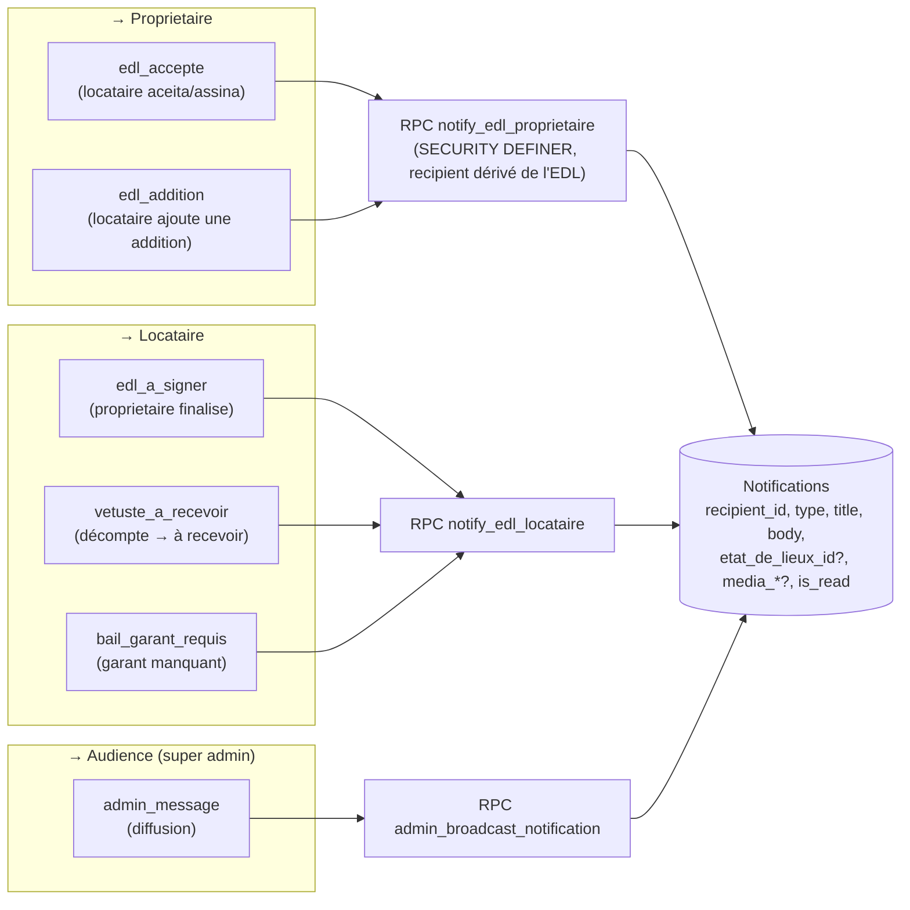
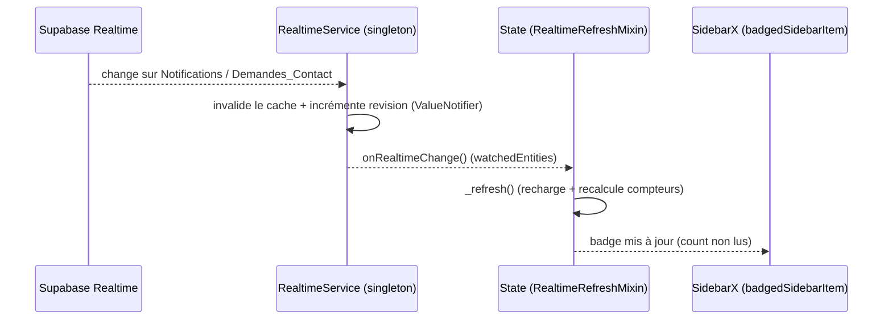

# Notifications, badges & Realtime

> Notificações in-app para **proprietaire e locataire** (tabela `Notifications`,
> `recipient_id` = destinatário efetivo). Code :
> [notifications.dart](../lib/data/datasources/notifications.dart),
> [realtime_service.dart](../lib/data/cache/realtime_service.dart),
> [app_sidebar.dart](../lib/presentation/nav/app_sidebar.dart).

## Eventos

- **INSERT só via RPC** `SECURITY DEFINER` (o `recipient_id` é derivado do EDL / da audiência,
  não falsificável). RLS de SELECT/UPDATE/DELETE por `recipient_id = auth.uid()`.
- Eventos do proprietaire (`edl_accepte`, `edl_addition`) também disparam **e-mail** via edge
  function `notify-edl` ; `edl_a_signer`/`vetuste_a_recevoir` são in-app/realtime.

## Badges de menu + Realtime

- **Publicação realtime reduzida** a 2 tabelas leves : `Notifications` + `Demandes_Contact`.
  As demais entidades dependem de cache + recarregamento em ação/navegação.
- **Badges** (`badgedSidebarItem`) :
  - Proprietaire → **Interactions** = notifs não lidas + demandes não estabelecidas.
  - Locataire → **État des lieux** = EDL finalizados não assinados ; **Messages/Interactions** = notifs não lidas.
- O badge **só some quando o item é tratado** (assinar / ler / contato estabelecido).
- UI : aba **Notifications** na `InteractionsPage` (proprietaire) + « Notifications récentes »
  na `VueGeneralePage` ; menu **Interactions/Messages** do locataire (`NotificationCard`).
