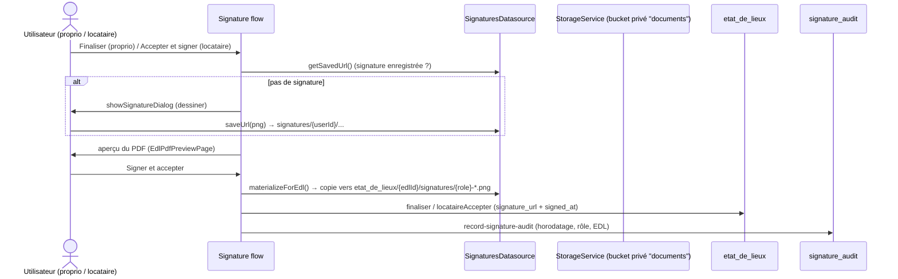
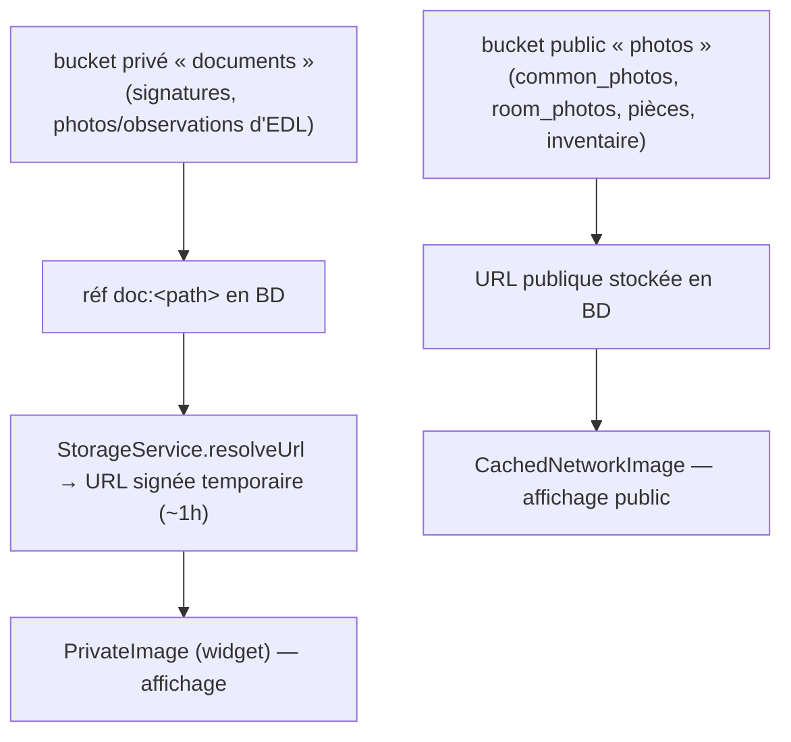

# Signatures électroniques & stockage privé

> Assinatura do proprietaire (à la finalisation) e do locataire (à l'acceptation),
> matérialisation no EDL para o PDF cross-party, et journal d'audit.
> Code : [signatures.dart](../lib/data/datasources/signatures.dart),
> [edl_signature_flow.dart](../lib/presentation/widgets/edl_signature_flow.dart),
> edge function `record-signature-audit`.

## Fluxo de assinatura

- **Dois momentos**:
  - **Proprietaire** assina ao **finaliser** (`proprietaire_signature_url` + `proprietaire_signed_at`).
  - **Locataire** assina ao **accepter** (`locataire_signature_url` + `locataire_signed_at`,
    grava `date_finalisation`) via `runLocataireSignatureFlow` (verifica/cria assinatura →
    vê o PDF → grava).
- **`materializeForEdl`** copia a assinatura salva do usuário para o espaço do EDL
  (`etat_de_lieux/{edlId}/signatures/{role}-*.png`) para que **ambas as partes** a vejam no PDF
  (RLS `can_access_edl`).
- **Journal d'audit** : edge function `record-signature-audit` insere uma linha em
  `signature_audit` (preuve horodatée).
- **Robustesse (bouton non bloqué)** : as notificações pós-assinatura são **best-effort**
  (try/catch) → uma falha de notificação/e-mail não faz a assinatura parecer ter falhado.
  `requestSignature`/`requestBailCompletion` só gravam o anti-spam `last_signature_request_at`
  **após** notificar com sucesso → o botão « Demander signature » não fica travado 5 dias por um
  erro. Após aceitar, `EtatDesLieuxDatasource.isLocataireSigned(id)` **verifica** que
  `locataire_accepte=true` + `locataire_signature_url` presente e confirma na UI (senão avisa).

## Stockage (dois buckets)

- Conteúdo sensível (assinaturas, fotos de EDL/observations/additions) → bucket **privé**
  `documents`, guardado como `doc:<path>`, exibido via **`PrivateImage`** (URL assinada temporária).
- Conteúdo público (imóveis/quartos/pièces/inventaire) → bucket **`photos`**, `CachedNetworkImage`.
- PDF (`edl_pdf_builder`) usa `StorageService.downloadBytes` (trata `doc:` e público).
