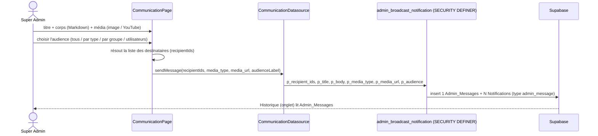

# Communication (Super Admin) — diffusion de messages

> Menu **Communication** do super admin : compõe uma mensagem (Markdown + mídia
> image/YouTube) e difunde como `Notifications` por audiência. Code :
> [communication_page.dart](../lib/presentation/users/admin/communication_page.dart),
> [communication.dart](../lib/data/datasources/communication.dart),
> [media_embed.dart](../lib/utils/media_embed.dart).

## Fluxo de diffusion

- **Audiências** : `tous` · par **type** d'utilisateur · par **groupe** · liste d'**utilisateurs**.
  A resolução em destinatários é feita **no app** ; a RPC só grava (parametrizada, sem injeção).
- **`admin_broadcast_notification`** (`SECURITY DEFINER`, só super admin) grava **1**
  `Admin_Messages` (historique) + **1** `Notifications` por destinatário, com
  `media_type` / `media_url` / `admin_message_id`.
- **Render** (`media_embed.dart`) : `NotificationCard` renderiza o corpo em **Markdown**
  (sem HTML bruto → sem XSS) ; imagem `http(s)` validada ; YouTube via iframe no web
  (id validado, 11 chars). O locataire vê em **Interactions/Messages** ; o proprietaire em
  **Notifications**.

## Segurança

- Escritas parametrizadas (sem SQL injection) ; Markdown sem HTML bruto (sem XSS) ;
  id YouTube validado. A RPC valida que o chamador é **super admin**.
